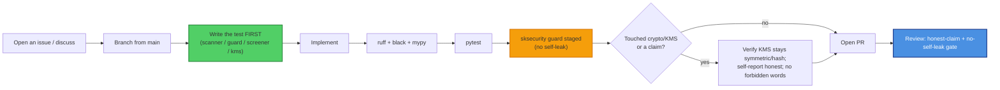

# Contributing to SKSecurity

Thanks for helping with `sksecurity` — the **Security capability** of SKWorld
(scanner · secret guard · screener · sovereign KMS · quarantine · monitor · MCP ·
dashboard), and the ecosystem's **honest-claim auditor**. Because SKSecurity both
handles key material and *enforces* the crypto-claim rules on everyone else, it must
be exemplary: the honest-claim rules are **non-negotiable**, and this repo must never
leak its own secrets.

By participating you agree to the [Code of Conduct](CODE_OF_CONDUCT.md). All
contributions are licensed under **GPL-3.0-or-later** (this repo's recorded license —
not relicensed).

---

## Ground rules (read before you write code)

From the sk-standards
[CRYPTOGRAPHY_STANDARD](https://github.com/smilinTux/sk-standards), enforced in review:

1. **We bind vetted crypto; we never hand-roll primitives.** The KMS uses pyca
   `cryptography` (scrypt / HKDF-SHA256 / AES-256-GCM). Do not hand-roll a cipher, KDF,
   or KEM.
2. **The KMS stays symmetric/hash.** No PGP key as the master root — that would
   re-introduce a Shor-vulnerable root. If a public-key root is ever needed, it
   migrates to a hybrid / SLH-DSA root first.
3. **Local-first, no phone-home.** Findings stay under `~/.sksecurity/`. Don't add a
   silent outbound call; threat feeds are opt-in and explicit.
4. **This repo must not leak its own secrets.** Run `sksecurity guard staged` before
   every commit (or install the hook). The CI/self-scan gate blocks a leak.
5. **No claim without evidence.** Detection logic ships with a test; the self-report
   must accurately reflect the live primitive — never assert a level it can't show.

### Claim-language discipline (hard rule — we are the auditor)

In code, comments, docstrings, docs, marketing, **and commit messages**:

- ✅ Say **"quantum-resistant" / "post-quantum."**
- ❌ Never say **"quantum-proof," "quantum-safe," "unbreakable,"** or **"CNSA 2.0
  compliant,"** and never imply **AES-256 is broken by quantum** (Grover only halves
  it to ~128-bit, which is safe).
- Every claim cites **surface + FIPS number + hybrid-vs-classical**.
- Never describe a classical surface as quantum-resistant; never call SKSecurity a KEM,
  signature scheme, or transport.
- The **experimental / unaudited** banner stays in README, SOP, and SECURITY until a
  real third-party audit lands.

Our own claim-audit will flag these — a PR that introduces a forbidden word, even in a
comment, is blocked.

---

## Development workflow



### Setup

```bash
git clone https://github.com/smilinTux/sksecurity
cd sksecurity
python -m venv .venv && . .venv/bin/activate
pip install -e ".[web,dev]"
pytest && ruff check . && black --check . && mypy sksecurity/
sksecurity guard install         # add the pre-commit secret hook
```

---

## What a good PR looks like

- **Scoped.** One logical change.
- **Tested.** New detection/KMS behaviour has a test; bug fixes add a regression test
  that fails before and passes after.
- **Honest.** No new claim exceeds the evidence; no forbidden words; the self-report
  accurately reflects the live primitive; the unaudited banner intact.
- **No self-leak.** `sksecurity guard staged` is clean.
- **Documented.** README / SOP / CHANGELOG updated when behaviour changes.

### Especially welcome

- New **secret patterns** (with a test fixture + a real-world false-positive guard).
- Tighter **prompt-injection / exfiltration** screening with evaluation cases.
- Better **self-report** coverage so consumers can prove per-channel
  `KEM / sig / cipher + hybrid-vs-classical`.

### Out of scope (by design)

- A hand-written crypto primitive, or a PGP master root for the KMS.
- Making SKSecurity a KEM / signature scheme / transport / identity provider (that is
  `sk_pqc` / `capauth`).
- A silent outbound network call.

---

## Commits

- **Conventional, imperative subject lines** (`fix:`, `feat:`, `test:`, `docs:`).
  Reference the issue.
- **Honest-claim discipline applies to commit messages too.**
- When a contribution is co-authored by an AI agent, end the commit with the trailer:

  ```
  Co-Authored-By: Claude Opus 4.8 <noreply@anthropic.com>
  ```

  (Credit every co-author with a `Co-Authored-By:` trailer.)

---

## Reporting security issues

**Do not** open a public issue for a vulnerability. Follow [SECURITY.md](SECURITY.md)
(private GitHub Security Advisory or maintainer email, coordinated disclosure).

Thanks for keeping the perimeter local and the claims honest. 🐧 **SK =
staycuriousANDkeepsmilin**
