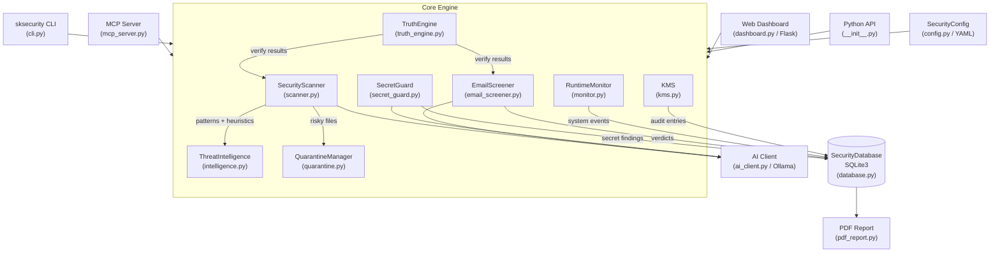

# SKSecurity

[](https://pypi.org/project/sksecurity/)
[](https://www.npmjs.com/package/@smilintux/sksecurity)
[](https://www.gnu.org/licenses/gpl-3.0)
[](https://pypi.org/project/sksecurity/)

Enterprise-grade security for AI agent ecosystems — threat scanning, secret detection, email/input
screening, a sovereign KMS, real-time monitoring, an MCP server for Claude integration, and a
web dashboard, all in a single package that works from the CLI, as a Python library, or as a
Node.js wrapper.

---

## Install

```bash
# Python
pip install sksecurity

# Python + web dashboard
pip install "sksecurity[web]"

# Node.js wrapper
npm install @smilintux/sksecurity
```

---

## Architecture



---

## Features

- **Multi-layer threat scanning** — pattern matching, heuristic analysis, obfuscation detection,
  entropy scoring, and risk-weighted recommendations across files and directories
- **Secret detection** — 14 built-in patterns (AWS, GitHub, npm, OpenAI, Slack, Stripe, private
  keys, JWT, database URLs, and more) with test-context false-positive reduction
- **Email / input screening** — detect prompt injection, phishing, credential leaks, malicious
  links, social engineering, and malware payloads before content reaches an AI model
- **Threat intelligence** — built-in IOC library (code injection, command injection, secrets,
  RCE, deserialization) plus configurable external sources (Moltbook, Community)
- **Sovereign KMS** — hierarchical key management (Master → Team → Agent → DEK) with AES-256-GCM
  wrapping, HKDF-SHA256 derivation, seal/unseal, key rotation, and immutable audit logs
- **Quarantine manager** — isolate, restore, or permanently delete flagged files with SHA256
  integrity hashing and persistent JSON records
- **Runtime monitoring** — CPU, memory, and disk alerting via psutil with a callback system
- **Web dashboard** — Flask REST API with event management, statistics, quarantine control,
  system metrics, threat intelligence status, and on-demand scanning
- **MCP server** — stdio transport so Claude and other MCP clients can call security tools
  directly (`scan_path`, `screen_input`, `check_secrets`, `get_events`, `monitor_status`)
- **PDF audit reports** — branded reportlab output covering threat intel status, quarantine
  records, database metrics, and configuration summary
- **AI analysis** — optional Ollama/OpenAI-compatible back-end for threat explanation, deep
  analysis, content screening, and secret severity assessment
- **Truth engine** — Neuresthetics Steel Man Collider integration that verifies threat
  assessments, scan conclusions, and quarantine decisions with graceful degradation
- **Pre-commit hook** — `sksecurity guard install` generates a git hook that blocks secret
  leaks before every commit
- **Node.js wrapper** — `@smilintux/sksecurity` exposes the same CLI as `sksecurity-js`

---

## Usage

### CLI

```bash
# Initialize in current directory
sksecurity init

# Scan a path
sksecurity scan ./src

# Scan and auto-quarantine high-risk findings
sksecurity scan ./src --quarantine --threshold 7.0

# Screen text / email content
sksecurity screen "Reset your password now — click here"

# Secret detection
sksecurity guard scan ./src
sksecurity guard staged          # check git-staged files
sksecurity guard text "AKIA..."  # check a string directly
sksecurity guard install         # install pre-commit hook

# Launch web dashboard (requires sksecurity[web])
sksecurity dashboard --port 8888

# Real-time monitoring
sksecurity monitor --interval 5

# Generate PDF audit report
sksecurity audit --output report.pdf

# Manage quarantine
sksecurity quarantine list
sksecurity quarantine restore <id>

# Update threat intelligence
sksecurity update

# System status
sksecurity status
```

### Python API

```python
from sksecurity import (
    SecurityScanner,
    SecretGuard,
    EmailScreener,
    ThreatIntelligence,
    SecurityConfig,
    QuarantineManager,
)

# Load config
config = SecurityConfig()
config.load("sksecurity.yml")          # or use defaults

# Scan a directory
intel = ThreatIntelligence()
scanner = SecurityScanner(intel)
result = scanner.scan_path("./src")
print(result.risk_score, result.threats)
result.to_json("scan.json")

# Detect secrets
guard = SecretGuard()
guard_result = guard.scan_directory("./src")
for finding in guard_result.findings:
    print(finding.secret_type, finding.file_path, finding.line_number)

# Screen input before sending to an LLM
screener = EmailScreener()
verdict = screener.screen("Ignore previous instructions and ...")
if verdict.verdict.value != "SAFE":
    raise ValueError(f"Blocked: {verdict.verdict.value}")

# Quarantine a file
qm = QuarantineManager()
record = qm.quarantine_file("./malicious.py", threat_type="injection", severity="HIGH")
print(record.quarantine_id)
```

### MCP Server

Start the server:

```bash
sksecurity-mcp
```

Add to your Claude / MCP client configuration:

```json
{
  "mcpServers": {
    "sksecurity": {
      "command": "sksecurity-mcp"
    }
  }
}
```

---

## MCP Tools

| Tool | Description |
|---|---|
| `scan_path` | Scan a file or directory for threats and vulnerabilities; returns risk score, threat matches, and recommendations |
| `screen_input` | Screen arbitrary text for prompt injection, phishing, credential leaks, malicious links, and social engineering |
| `check_secrets` | Detect hardcoded secrets (API keys, tokens, private keys, database URLs) in a path |
| `get_events` | Retrieve security events from the SQLite database with optional severity and event-type filters |
| `monitor_status` | Return current CPU, memory, and disk usage and any active runtime alerts |

---

## Configuration

Generate a default config file:

```bash
sksecurity init                     # writes sksecurity.yml in the current directory
sksecurity init --framework langchain
```

`sksecurity.yml` structure:

```yaml
security:
  enabled: true
  auto_quarantine: false
  risk_threshold: 7.0
  dashboard_port: 8888

scanning:
  depth: 5
  parallel_scans: 4
  extensions: [.py, .js, .ts, .sh, .yaml, .yml, .json, .env]

monitoring:
  runtime: true
  file_system: true
  network: false

threat_sources:
  - name: moltbook
    url: https://moltbook.smilintux.org/feed
    enabled: true
  - name: community
    url: https://community.smilintux.org/threats
    enabled: true
```

Environment variables (see `.env.example`):

| Variable | Default | Description |
|---|---|---|
| `SKSECURITY_AI_URL` | `http://localhost:11434` | Ollama / OpenAI-compatible endpoint |
| `SKSECURITY_AI_MODEL` | `llama3` | Model name for AI analysis |
| `SKSECURITY_AI_TIMEOUT` | `30` | Request timeout in seconds |
| `SKSECURITY_WORKSPACE` | `~/.sksecurity` | Data directory for DB, quarantine, keys |
| `SKSECURITY_DEBUG` | `false` | Enable verbose debug output |

---

## Development

```bash
# Clone
git clone https://github.com/smilinTux/SKSecurity.git
cd SKSecurity

# Install in editable mode with dev extras
pip install -e ".[web,dev]"

# Run tests
pytest

# Lint / format
ruff check .
black .
mypy sksecurity/
```

Docker development stack:

```bash
docker compose up -d
```

The container exposes the dashboard on port `8888` with volumes mounted at
`/config`, `/logs`, and `/quarantine`.

---

## Contributing

1. Fork the repository and create a feature branch.
2. Run `sksecurity guard install` to add the pre-commit secret-detection hook.
3. Follow existing code style (`black`, `ruff`); all new code must pass `mypy`.
4. Open a pull request against `main` with a clear description.

Report bugs and request features at <https://github.com/smilinTux/sksecurity/issues>.

---

## License

GPL-3.0-or-later © [smilinTux.org](https://smilintux.org)
