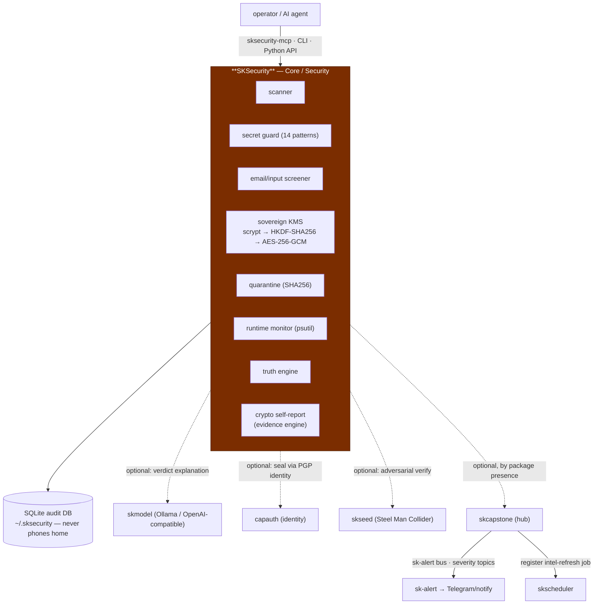
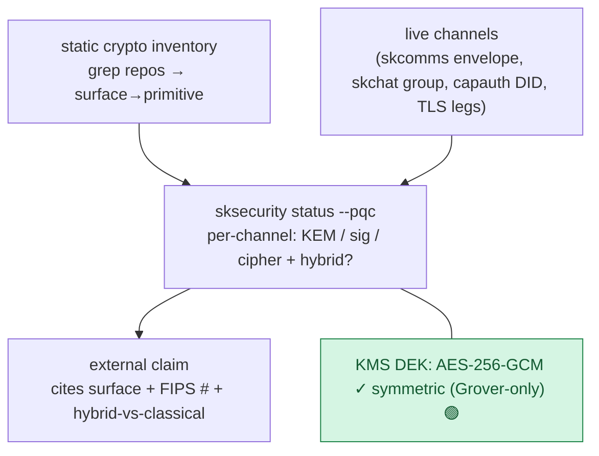
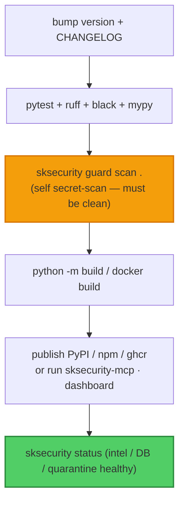

# SKSecurity — Standard Operating Procedures

`sksecurity` is the **Security capability** of SKWorld: a local-first, AI-native
engine (one Python package + MCP server + web dashboard) that scans code before it
runs, screens input before it reaches a model, catches secrets before they leave a
repo, seals keys you own in a sovereign **KMS**, quarantines flagged artifacts, and
keeps an immutable audit trail under `~/.sksecurity/` — **never phoning home**. In the
ecosystem PQC migration it is also the **evidence engine**: the place that produces
the runtime crypto self-report that makes every other repo's quantum-resistance claim
*evidence-backed rather than asserted*.

**Maturity tier:** **T0 — symmetric/hash (already quantum-acceptable).**
SKSecurity's own crypto is the internal KMS tree —
**scrypt → HKDF-SHA256 → AES-256-GCM**, DEK = `os.urandom(32)` — which is **entirely
symmetric/hash and therefore quantum-acceptable** (Grover only halves AES-256 to
~128-bit, which is safe). It holds **no asymmetric key material of its own**, so there
is **no Shor-vulnerable surface to migrate** — *unless* a PGP key is ever wired as the
KMS master root, which would re-introduce a Shor-vulnerable root and must then migrate
to a hybrid / SLH-DSA root. Per-surface inventory + the runtime self-report design:
[docs/QUANTUM_RESISTANCE.md](docs/QUANTUM_RESISTANCE.md).

**CRYPTOGRAPHY_STANDARD compliance:** SKSecurity conforms to — and **enforces** — the
sk-standards [CRYPTOGRAPHY_STANDARD](https://github.com/smilinTux/sk-standards): it is
the honest-claim **auditor** (scans docs/marketing for forbidden words —
"quantum-proof" / "unbreakable" / "quantum-safe" / "CNSA 2.0 compliant" / "FIPS 206 /
Falcon", and AES-256-is-broken claims) and the **self-report producer** (the static
crypto inventory + the per-channel `KEM / signature / cipher + hybrid-vs-classical`
runtime report, citing FIPS 203/204/205). It binds vetted crypto (pyca
`cryptography` — scrypt / HKDF / AES-256-GCM) and **hand-rolls no primitives**; where
the ecosystem combines a hybrid secret it is `HKDF(X25519_ss ‖ MLKEM768_ss)` — never
XOR, never pure-PQ.

**Standards anchored:** FIPS 203 (ML-KEM), FIPS 204 (ML-DSA), FIPS 205 (SLH-DSA),
SP 800-38D (AES-GCM), RFC 5869 (HKDF), RFC 7914 (scrypt), NIST CSWP 39
(crypto-agility). **License:** GPL-3.0-or-later (legacy — recorded, not relicensed).
**Python:** ≥ 3.10.

---

## 1. Overview

**What SKSecurity owns:**

- **Threat scanner** (`scanner.py`) — multi-layer file/dir scan → weighted
  `risk_score` (0–100), `ThreatMatch` list, recommendations.
- **Secret guard** (`secret_guard.py`) — 14 secret patterns + git pre-commit hook.
- **Email/input screener** (`email_screener.py`) — prompt-injection / phishing /
  credential-leak screening *before* the model sees content.
- **Sovereign KMS** (`kms.py`) — hierarchical keys (Master→Team→Agent→DEK),
  AES-256-GCM wrap, scrypt master seal, HKDF-SHA256 derivation, rotation, audit log.
- **Quarantine** (`quarantine.py`), **runtime monitor** (`monitor.py`), **truth
  engine** (`truth_engine.py`), **audit DB** (`database.py`), **web dashboard**,
  **PDF report**, **MCP server** (`mcp_server.py`).
- The ecosystem **crypto self-report** (the evidence engine for PQC claims).

**What SKSecurity explicitly does NOT do:**

- It is **not** a transport, a KEM, or a signature scheme — it does not establish
  session secrets or authenticate peers (that is `sk_pqc` / `capauth`).
- It does **not** phone home — all findings stay in the local SQLite DB.
- Its KMS is **not** a Shor-vulnerable root today; it must not become one (no PGP
  master root without migrating it to hybrid/SLH-DSA first).

---

## 2. Architecture



Every platform-primitive arrow is **dashed/optional** — SKSecurity runs fully
standalone (no `skcapstone` dependency in `pyproject.toml`; imports no framework
modules) and *upgrades* when peers are present. Full source map:
[docs/ARCHITECTURE.md](docs/ARCHITECTURE.md).

### The PQC self-report (evidence flow)



---

## 3. Build

```bash
pip install -e ".[web,dev]"      # core + dashboard + dev tooling
python -m pip install --upgrade build && python -m build   # wheel/sdist
docker build -t sksecurity docker/   # optional container (see docker/)
npm install @smilintux/sksecurity    # Node wrapper (shells to the Python CLI)
```

---

## 4. Test

```bash
pytest                           # tests/ — scanner, guard, screener, kms, quarantine, mcp, db
ruff check . && black --check . && mypy sksecurity/
sksecurity guard install         # add the pre-commit secret hook to this repo
```

| Suite | Covers |
|---|---|
| scanner | risk scoring, threat-pattern matches, obfuscation/entropy signals |
| secret guard | 14 patterns, staged-diff scan, test-context FP reduction |
| screener | the 7 `ThreatCategory` verdicts, prompt-injection detection |
| kms | key hierarchy, AES-256-GCM wrap, scrypt seal, HKDF derivation, rotation, audit log |
| quarantine | isolate / list / restore / delete with SHA256 integrity records |
| mcp / db | the 5 MCP tools; `SecurityEvent` persistence |

The green-bar gate that blocks release: the full `pytest` suite + lint/type clean +
the secret-guard self-scan (this repo must not leak its own secrets).

---

## 5. Release / Deploy

**Library / MCP / Node wrapper:** bump `version` in `pyproject.toml`, add a
`CHANGELOG.md` entry, run the test gate, `python -m build`, tag `vX.Y.Z`, push, then
publish (PyPI / npm) per the maintainer flow.

**Dashboard / MCP service (deploy):**



### Front-end / Exposure

Per [sk-standards `UNIFIED_INGRESS_STANDARD.md`](https://github.com/smilinTux/sk-standards/blob/main/standards/UNIFIED_INGRESS_STANDARD.md):

**N/A — no network surface.** sksecurity is a CLI / Python library + MCP (stdio)
secret-scanner; it serves no public `:443` route and binds no listener. The
`dashboard_port` config knob (default `8888`, `sksecurity/config.py`) is an unimplemented
placeholder — no HTTP server backs it. If a dashboard is ever shipped it MUST bind
`127.0.0.1` / tailnet behind a Tier 0 Funnel path-route, never a public port.

---

## 6. Configuration / Usage

`sksecurity init` writes `sksecurity.yml` and creates the data-root `~/.sksecurity/`.

| Knob | Where | Effect |
|---|---|---|
| `risk_threshold` / `auto_quarantine` | `sksecurity.yml` | scan verdict thresholds + isolation |
| `dashboard_port` | `sksecurity.yml` | web dashboard port (default 8888) |
| `threat_sources[]` | `sksecurity.yml` | external IOC feeds (opt-in) |
| `SKSECURITY_AI` / `--ai` | env / flag | enable local-LLM verdict explanation |
| `SKSECURITY_AI_URL` | env | Ollama / OpenAI-compatible endpoint (default `:11434`) |
| `SKSECURITY_AI_MODEL` | env | model for AI analysis |
| `SK_STANDALONE=1` | env | force standalone (ignore skcapstone) |

**Never inline a live secret** — the secret guard exists precisely to catch that; run
`sksecurity guard staged` before every commit (or install the hook).

---

## 7. API / Reference

**CLI:** `scan · screen · guard · monitor · quarantine · update · audit · status ·
init · dashboard` (see the README for full examples).

**MCP tools** (`sksecurity-mcp`, stdio):

| Tool | Description |
|---|---|
| `scan_path` | scan a file/dir → risk score, threat matches, recommendations |
| `screen_input` | screen text for injection / phishing / credential leak / social eng |
| `check_secrets` | detect hardcoded secrets in text |
| `get_events` | retrieve security events from the local DB (severity / type filters) |
| `monitor_status` | current CPU/mem/disk + active runtime alerts |

**Python:** `from sksecurity import ...` — `scanner`, `secret_guard`,
`email_screener`, `kms`, `quarantine`, `monitor`, `database`, `config`.

---

## 8. Troubleshooting

| Symptom | Likely cause | Fix |
|---|---|---|
| scan exits non-zero unexpectedly | `risk_score` over `risk_threshold` | review the `ThreatMatch` list; lower threshold or `--no-quarantine` for triage |
| secret guard flags a test fixture | FP in test context | confirm it's truly a fixture; the guard already reduces test-context FPs — refine the pattern, don't disable |
| `--ai` does nothing / errors | no Ollama / wrong endpoint | set `SKSECURITY_AI_URL` to a running Ollama or OpenAI-compatible server; AI is optional |
| dashboard won't bind | port in use | change `dashboard_port` in `sksecurity.yml` |
| MCP client can't see tools | server not launched | run `sksecurity-mcp`; add it to the client's `mcpServers` |
| KMS unlock fails | wrong master passphrase / moved data-root | the scrypt master seal needs the original passphrase; restore `~/.sksecurity/` |
| claim-audit flags your docs | a forbidden crypto word present | replace with "quantum-resistant" / "post-quantum"; cite surface + FIPS # + hybrid-vs-classical |

---

## 9. Maturity-tier + Version reference

- **Maturity tier:** **T0 — symmetric/hash, already quantum-acceptable.** The KMS
  (scrypt → HKDF-SHA256 → AES-256-GCM, DEK `os.urandom(32)`) holds **no asymmetric
  key material**; there is no Shor-vulnerable surface to migrate. Caveat: a PGP master
  root would re-introduce one and must then migrate to hybrid/SLH-DSA.
- **VERSION_LIFECYCLE phase:** Active (v2). **SemVer:** `1.2.1` (`pyproject.toml`).
- **CRYPTOGRAPHY_STANDARD compliance:** SKSecurity both conforms to and **enforces**
  the standard — it is the honest-claim auditor and the runtime self-report producer
  (per-channel KEM/sig/cipher + hybrid-vs-classical, citing FIPS 203/204/205). Hybrid
  combine, where used in the ecosystem, is `HKDF(X25519 ‖ MLKEM768)` — never XOR.
- **PQC role:** epic `PQC-MIGRATION` (coord `e1d6ba2a`); the evidence engine for the
  whole fleet. Master plan = skchat `docs/quantum-resistance-architecture.md`.

---

**SK = staycuriousANDkeepsmilin 🐧** — *sksecurity: same disciplines, your hardware, your seal.*
