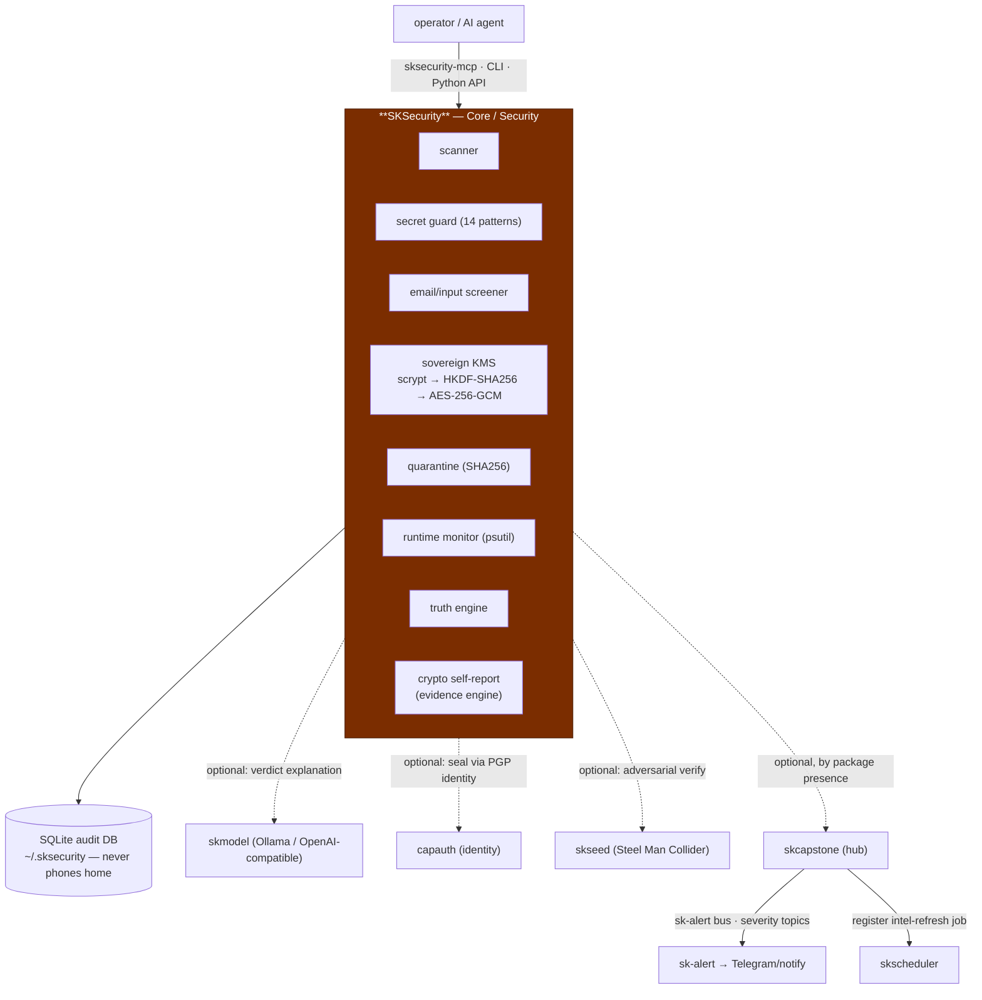
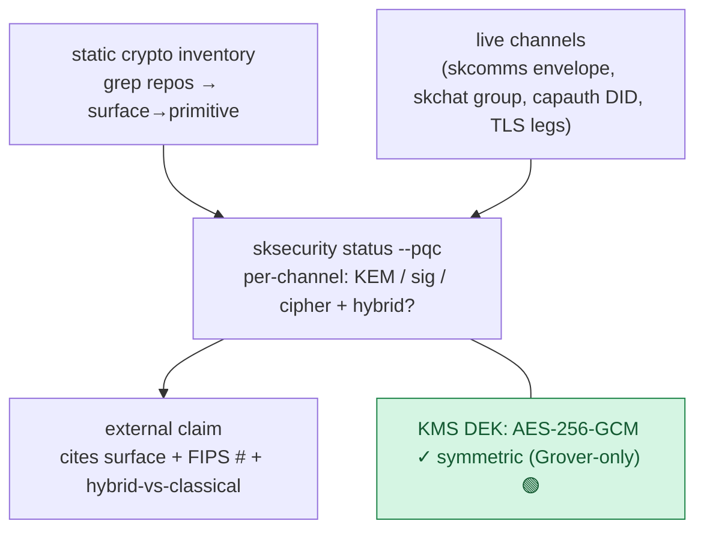
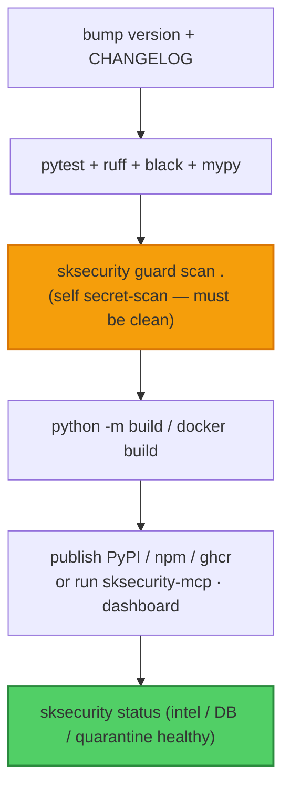

# SKSecurity — Standard Operating Procedures

`sksecurity` is the **Security capability** of SKWorld: a local-first, AI-native
engine (one Python package + MCP server + web dashboard) that scans code before it
runs, screens input before it reaches a model, catches secrets before they leave a
repo, seals keys you own in a sovereign **KMS**, quarantines flagged artifacts, and
keeps an immutable audit trail under `~/.sksecurity/` — **never phoning home**. In the
ecosystem PQC migration it is also the **evidence engine**: the place that produces
the runtime crypto self-report that makes every other repo's quantum-resistance claim
*evidence-backed rather than asserted*.

**Maturity tier:** **T0 — symmetric/hash (already quantum-acceptable).**
SKSecurity's own crypto is the internal KMS tree —
**scrypt → HKDF-SHA256 → AES-256-GCM**, DEK = `os.urandom(32)` — which is **entirely
symmetric/hash and therefore quantum-acceptable** (Grover only halves AES-256 to
~128-bit, which is safe). It holds **no asymmetric key material of its own**, so there
is **no Shor-vulnerable surface to migrate** — *unless* a PGP key is ever wired as the
KMS master root, which would re-introduce a Shor-vulnerable root and must then migrate
to a hybrid / SLH-DSA root. Per-surface inventory + the runtime self-report design:
[docs/QUANTUM_RESISTANCE.md](docs/QUANTUM_RESISTANCE.md).

**CRYPTOGRAPHY_STANDARD compliance:** SKSecurity conforms to — and **enforces** — the
sk-standards [CRYPTOGRAPHY_STANDARD](https://github.com/smilinTux/sk-standards): it is
the honest-claim **auditor** (scans docs/marketing for forbidden words —
"quantum-proof" / "unbreakable" / "quantum-safe" / "CNSA 2.0 compliant" / "FIPS 206 /
Falcon", and AES-256-is-broken claims) and the **self-report producer** (the static
crypto inventory + the per-channel `KEM / signature / cipher + hybrid-vs-classical`
runtime report, citing FIPS 203/204/205). It binds vetted crypto (pyca
`cryptography` — scrypt / HKDF / AES-256-GCM) and **hand-rolls no primitives**; where
the ecosystem combines a hybrid secret it is `HKDF(X25519_ss ‖ MLKEM768_ss)` — never
XOR, never pure-PQ.

**Standards anchored:** FIPS 203 (ML-KEM), FIPS 204 (ML-DSA), FIPS 205 (SLH-DSA),
SP 800-38D (AES-GCM), RFC 5869 (HKDF), RFC 7914 (scrypt), NIST CSWP 39
(crypto-agility). **License:** GPL-3.0-or-later (legacy — recorded, not relicensed).
**Python:** ≥ 3.10.

---

## 1. Overview

**What SKSecurity owns:**

- **Threat scanner** (`scanner.py`) — multi-layer file/dir scan → weighted
  `risk_score` (0–100), `ThreatMatch` list, recommendations.
- **Secret guard** (`secret_guard.py`) — 14 secret patterns + git pre-commit hook.
- **Email/input screener** (`email_screener.py`) — prompt-injection / phishing /
  credential-leak screening *before* the model sees content.
- **Sovereign KMS** (`kms.py`) — hierarchical keys (Master→Team→Agent→DEK),
  AES-256-GCM wrap, scrypt master seal, HKDF-SHA256 derivation, rotation, audit log.
- **Quarantine** (`quarantine.py`), **runtime monitor** (`monitor.py`), **truth
  engine** (`truth_engine.py`), **audit DB** (`database.py`), **web dashboard**,
  **PDF report**, **MCP server** (`mcp_server.py`).
- The ecosystem **crypto self-report** (the evidence engine for PQC claims).

**What SKSecurity explicitly does NOT do:**

- It is **not** a transport, a KEM, or a signature scheme — it does not establish
  session secrets or authenticate peers (that is `sk_pqc` / `capauth`).
- It does **not** phone home — all findings stay in the local SQLite DB.
- Its KMS is **not** a Shor-vulnerable root today; it must not become one (no PGP
  master root without migrating it to hybrid/SLH-DSA first).

---

## 2. Architecture


```mermaid
flowchart TD
    OP["operator / AI agent"] -->|"sksecurity-mcp · CLI · Python API"| SKSEC

    subgraph SKSEC["**SKSecurity** — Core / Security"]
      direction LR
      SCAN["scanner"]
      GUARD["secret guard (14 patterns)"]
      SCREEN["email/input screener"]
      KMS["sovereign KMS<br/>scrypt → HKDF-SHA256 → AES-256-GCM"]
      QUAR["quarantine (SHA256)"]
      MON["runtime monitor (psutil)"]
      TRUTH["truth engine"]
      RPT["crypto self-report<br/>(evidence engine)"]
    end

    SKSEC --> DB[("SQLite audit DB<br/>~/.sksecurity — never phones home")]

    SKSEC -.->|"optional: verdict explanation"| MODEL["skmodel (Ollama / OpenAI-compatible)"]
    SKSEC -.->|"optional: seal via PGP identity"| CAPAUTH["capauth (identity)"]
    SKSEC -.->|"optional: adversarial verify"| SKSEED["skseed (Steel Man Collider)"]
    SKSEC -.->|"optional, by package presence"| SKCAP["skcapstone (hub)"]
    SKCAP -->|"sk-alert bus · severity topics"| ALERT["sk-alert → Telegram/notify"]
    SKCAP -->|"register intel-refresh job"| SCHED["skscheduler"]

    style SKSEC fill:#7b2d00,color:#fff,stroke:#4a1a00
```

Every platform-primitive arrow is **dashed/optional** — SKSecurity runs fully
standalone (no `skcapstone` dependency in `pyproject.toml`; imports no framework
modules) and *upgrades* when peers are present. Full source map:
[docs/ARCHITECTURE.md](docs/ARCHITECTURE.md).

### The PQC self-report (evidence flow)


```mermaid
flowchart TD
    INV["static crypto inventory<br/>grep repos → surface→primitive"] --> RPT["sksecurity status --pqc<br/>per-channel: KEM / sig / cipher + hybrid?"]
    LIVE["live channels<br/>(skcomms envelope, skchat group, capauth DID, TLS legs)"] --> RPT
    RPT --> CLAIM["external claim<br/>cites surface + FIPS # + hybrid-vs-classical"]
    classDef ok fill:#d5f5e3,stroke:#1e8449,color:#145a32;
    EX["KMS DEK: AES-256-GCM ✓ symmetric (Grover-only) 🟢"]:::ok
    RPT --- EX
```

---

## 3. Build

```bash
python3.12 -m venv .venv
.venv/bin/pip install -e ".[web,dev]" # repository-local development environment
python -m pip install --upgrade build && python -m build   # wheel/sdist
docker build -t sksecurity docker/   # optional container (see docker/)
npm install @smilintux/sksecurity    # Node wrapper (shells to the Python CLI)
```

Never install the operational CLI or MCP server into the shared SK stack
environment. On a sovereign node, install or refresh the owned runtime with:

```bash
scripts/install-runtime.sh
~/.venvs/sksecurity/bin/python -m pip check
readlink -f ~/.local/bin/sksecurity
```

The installer owns `~/.venvs/sksecurity`, installs the `web`, `pdf`, and
`skcapstone` runtime extras, and publishes only CLI symlinks in `~/.local/bin`.
Use `SKSECURITY_VENV`, `SKSECURITY_PYTHON`, or `SKSECURITY_REPO` to override its
defaults. Development tools remain in the repository-local `.venv` and do not
enter the operational runtime.

---

## 4. Test

```bash
pytest                           # tests/ — scanner, guard, screener, kms, quarantine, mcp, db
ruff check . && black --check . && mypy sksecurity/
sksecurity guard install         # add the pre-commit secret hook to this repo
```

| Suite | Covers |
|---|---|
| scanner | risk scoring, threat-pattern matches, obfuscation/entropy signals |
| secret guard | 14 patterns, staged-diff scan, test-context FP reduction |
| screener | the 7 `ThreatCategory` verdicts, prompt-injection detection |
| kms | key hierarchy, AES-256-GCM wrap, scrypt seal, HKDF derivation, rotation, audit log |
| quarantine | isolate / list / restore / delete with SHA256 integrity records |
| mcp / db | the 5 MCP tools; `SecurityEvent` persistence |

The green-bar gate that blocks release: the full `pytest` suite + lint/type clean +
the secret-guard self-scan (this repo must not leak its own secrets).

---

## 5. Release / Deploy

**Library / MCP / Node wrapper: the git tag is the version.** `pyproject.toml` declares
`dynamic = ["version"]` and carries **no** `version = ` field; setuptools-scm derives it
from the tag and writes `sksecurity/_version.py` at build time (gitignored, never
committed). So the release flow is: add a `CHANGELOG.md` entry, run the test gate,
`git tag vX.Y.Z`, push the tag, then `python -m build` and publish (PyPI / npm) per the
maintainer flow.

**Do not reintroduce a hardcoded `version`.** The comment at `pyproject.toml:7-16`
records why: a literal `version = "1.2.1"` was duplicated in `sksecurity/__init__.py`,
tags v1.2.2, v1.2.3 and v1.2.4 were each cut without bumping either copy, so every
release rebuilt 1.2.1 and PyPI rejected the duplicate with a bare `400 Bad Request`.
PyPI sat at 1.2.1 from 2026-06-11 while the repo was three tags ahead. The evidence
block at the end of this file fails if a static `version` field reappears.

**Dashboard / MCP service (deploy):**

Run `scripts/install-runtime.sh` first and configure any unit `ExecStart` to use
`%h/.venvs/sksecurity/bin/sksecurity-mcp`; do not use a shared environment's
Python or console script.


```mermaid
flowchart TD
    BUMP["bump version + CHANGELOG"] --> TEST["pytest + ruff + black + mypy"]
    TEST --> SELF["sksecurity guard scan .<br/>(self secret-scan — must be clean)"]
    SELF --> BUILD["python -m build / docker build"]
    BUILD --> SHIP["publish PyPI / npm / ghcr<br/>or run sksecurity-mcp · dashboard"]
    SHIP --> VERIFY["sksecurity status (intel / DB / quarantine healthy)"]
    style SELF fill:#f59e0b,stroke:#d97706,stroke-width:2px
    style VERIFY fill:#51cf66,stroke:#2b8a3e,stroke-width:2px
```

### Scheduled audit on a sovereign node (runs code OUTSIDE this repo)

A node may carry a user unit pair `sksecurity-audit.service` + `sksecurity-audit.timer`
(`OnCalendar=*-*-* 06:00:00`, `Persistent=true`). Do not assume it exercises this
repo: its `ExecStart` runs `~/clawd/security/scripts/security_cron.py`, a script that
lives outside SKSecurity and imports nothing from the `sksecurity` package. The unit
name is the only thing tying it to this repo. This repo ships **no** systemd unit of
its own, so nothing here is verified by that timer being green.

### Front-end / Exposure

Per [sk-standards `UNIFIED_INGRESS_STANDARD.md`](https://github.com/smilinTux/sk-standards/blob/main/standards/UNIFIED_INGRESS_STANDARD.md):

**Tier 0 / no public route. No listener is up in practice, but this repo is NOT
listener-free code.** Read the whole subsection before repeating "library, therefore no
network surface": that shorthand was wrong in an earlier revision of this SOP, and this
repo is the fleet's honest-claims auditor.

- **Shipped surface:** a CLI (`sksecurity`) plus an MCP server (`sksecurity-mcp`) that
  speaks **stdio**, not a socket. No public `:443` route, no reverse-proxy route, no
  Funnel path. Importing the package binds nothing.
- **`sksecurity/dashboard.py` is a real Flask application, not a placeholder.**
  `DashboardServer.__init__` constructs `Flask(__name__)` (`dashboard.py:47`) and wraps
  it with `CORS` (`dashboard.py:48`), registers **16** routes (including `/api/health`,
  `/api/kms/status`, `/api/kms/keys`, `/api/kms/rotate`, `/api/scan`,
  `/api/quarantine/restore`), and `start(blocking=True)` calls
  `self.app.run(host=self.host, port=self.port)` (`dashboard.py:316`); the non-blocking
  branch runs the same `app.run` on a daemon thread. Default port `8888`, default host
  `localhost` (`dashboard.py:27-28`; the config knob default is
  `sksecurity/config.py:40`, read back by the `dashboard_port` property at
  `config.py:195`).
- **A second, standalone HTTP server exists in `scripts/`:**
  `scripts/security_dashboard.py:370` binds `HTTPServer(('localhost', 8888), ...)`. It
  is a loose script, not a console entry point, so it only listens if an operator runs
  it by hand.
- **Why nothing listens today: the `sksecurity dashboard` CLI command is broken.** It is
  the only packaged path to `DashboardServer`, and it cannot construct or start one. See
  [Known defects](#known-defects-open) in section 8. The honest conclusion ("no listener")
  holds; the reason is a broken entry point, **not** absent code.

**Before that entry point is ever fixed**, note that the Flask app has **no
authentication of any kind**: there is no auth decorator, no `before_request` hook and
no token check anywhere in `dashboard.py`, so `/api/kms/rotate`, `/api/scan` and
`/api/quarantine/restore` would all be reachable by anyone who can reach the port. The
broken CLI already advertises `sksecurity dashboard --host 0.0.0.0 --ssl` in its own
`--help` examples (`cli.py:136`). Any revival MUST bind `127.0.0.1` or the tailnet
behind a Tier 0 Funnel path-route, never a public port, and MUST gain authentication in
the same change.

---

## 6. Configuration / Usage

`sksecurity init` writes `sksecurity.yml` and creates the data-root `~/.sksecurity/`.

| Knob | Where | Effect |
|---|---|---|
| `risk_threshold` / `auto_quarantine` | `sksecurity.yml` | scan verdict thresholds + isolation |
| `dashboard_port` | `sksecurity.yml` | port the Flask dashboard *would* bind (default 8888, `config.py:40`). Inert today: the `sksecurity dashboard` command that reads it is broken, see section 8 |
| `threat_sources[]` | `sksecurity.yml` | external IOC feeds (opt-in) |
| `SKSECURITY_AI` / `--ai` | env / flag | enable local-LLM verdict explanation |
| `SKSECURITY_AI_URL` | env | Ollama / OpenAI-compatible endpoint (default `:11434`) |
| `SKSECURITY_AI_MODEL` | env | model for AI analysis |
| `SK_STANDALONE=1` | env | force standalone (ignore skcapstone) |

**Never inline a live secret** — the secret guard exists precisely to catch that; run
`sksecurity guard staged` before every commit (or install the hook).

---

## 7. API / Reference

**CLI** (`sksecurity`, `sksecurity/cli.py`):

| Group | Commands |
|---|---|
| scan / screen | `scan`, `screen`, `monitor`, `quarantine`, `update`, `audit`, `init`, `status` |
| secret guard | `guard scan`, `guard staged`, `guard install`, `guard text` |
| honest claims | `claims scan`, `claims text` (the no-overclaim auditor, also run in CI) |
| PQC evidence | `pqc-report`, `pqc-stacks`, `pqc-snapshot`, `pqc-dashboard`, `pqc-posture` |
| broken | `dashboard` (does not run, see section 8) |

The self-report surface (this repo's reason to exist as the fleet evidence engine) is
`sksecurity status` plus the `pqc-*` family; the enforcement surface is
`sksecurity claims scan`. See the README for full examples.

**MCP tools** (`sksecurity-mcp`, stdio):

| Tool | Description |
|---|---|
| `scan_path` | scan a file/dir → risk score, threat matches, recommendations |
| `screen_input` | screen text for injection / phishing / credential leak / social eng |
| `check_secrets` | detect hardcoded secrets in text |
| `get_events` | retrieve security events from the local DB (severity / type filters) |
| `monitor_status` | current CPU/mem/disk + active runtime alerts |

**Python:** `from sksecurity import ...` — `scanner`, `secret_guard`,
`email_screener`, `kms`, `quarantine`, `monitor`, `database`, `config`.

---

## 8. Troubleshooting

| Symptom | Likely cause | Fix |
|---|---|---|
| scan exits non-zero unexpectedly | `risk_score` over `risk_threshold` | review the `ThreatMatch` list; lower threshold or `--no-quarantine` for triage |
| secret guard flags a test fixture | FP in test context | confirm it's truly a fixture; the guard already reduces test-context FPs — refine the pattern, don't disable |
| `--ai` does nothing / errors | no Ollama / wrong endpoint | set `SKSECURITY_AI_URL` to a running Ollama or OpenAI-compatible server; AI is optional |
| `sksecurity dashboard` fails immediately | the command is broken, not your config | known defect, see below. Changing `dashboard_port` will not help |
| MCP client can't see tools | server not launched | run `sksecurity-mcp`; add it to the client's `mcpServers` |
| KMS unlock fails | wrong master passphrase / moved data-root | the scrypt master seal needs the original passphrase; restore `~/.sksecurity/` |
| claim-audit flags your docs | a forbidden crypto word present | replace with "quantum-resistant" / "post-quantum"; cite surface + FIPS # + hybrid-vs-classical |
| `sksecurity-audit.timer` is green but nothing here ran | expected | that unit runs `~/clawd/security/scripts/security_cron.py`, outside this repo. See section 5 |

<a id="known-defects-open"></a>

### Known defects (open)

**1. `sksecurity dashboard` cannot start. It fails twice over.**

`cli.py:139-145` constructs the server as:

```python
server = DashboardServer(host=host, port=port, auth_enabled=auth,
                         ssl_enabled=ssl, config=config)
```

but `DashboardServer.__init__` (`dashboard.py:25-35`) accepts only
`port, host, db, quarantine, monitor, intel, kms, scanner`. None of `auth_enabled`,
`ssl_enabled` or `config` is a parameter, so the call raises `TypeError` before a server
object exists. Reproduce without installing anything:

```bash
python3 -c "import inspect; from sksecurity.dashboard import DashboardServer; \
print(inspect.signature(DashboardServer.__init__)); \
print(hasattr(DashboardServer,'run'), hasattr(DashboardServer,'run_background'))"
# -> the signature has no auth_enabled/ssl_enabled/config, and prints: False False
```

Even past that, `cli.py:154` calls `server.run_background()` and `cli.py:158` calls
`server.run()`. Neither method exists: `DashboardServer` defines only `start`, `stop`
and `get_url`. The `--auth` and `--ssl` flags are likewise decorative, since nothing in
`dashboard.py` implements either.

Fixing this is a **code** change and is deliberately out of scope for a docs pass. Until
it lands, treat the Flask app and its unauthenticated `/api/kms/*` routes as dormant
code, not as a shipped service. The evidence block at the end of this file asserts the
defect is still present, so this section cannot silently go stale after a fix.

---

## 9. Maturity-tier + Version reference

- **Maturity tier:** **T0 — symmetric/hash, already quantum-acceptable.** The KMS
  (scrypt → HKDF-SHA256 → AES-256-GCM, DEK `os.urandom(32)`) holds **no asymmetric
  key material**; there is no Shor-vulnerable surface to migrate. Caveat: a PGP master
  root would re-introduce one and must then migrate to hybrid/SLH-DSA.
- **VERSION_LIFECYCLE phase:** Active (v2). **SemVer: not written down here on purpose.**
  `pyproject.toml` sets `dynamic = ["version"]` and has no `version` field; the version
  comes from the newest `vX.Y.Z` git tag via setuptools-scm, which writes
  `sksecurity/_version.py` at build time. Read it from the tag
  (`git describe --tags --abbrev=0`) or from an installed build
  (`python -c "import sksecurity; print(sksecurity.__version__)"`), never from this
  document. An earlier revision of this SOP quoted `1.2.1`, which was already four tags
  stale. See section 5 for why hardcoding it broke releases.
- **CRYPTOGRAPHY_STANDARD compliance:** SKSecurity both conforms to and **enforces**
  the standard — it is the honest-claim auditor and the runtime self-report producer
  (per-channel KEM/sig/cipher + hybrid-vs-classical, citing FIPS 203/204/205). Hybrid
  combine, where used in the ecosystem, is `HKDF(X25519 ‖ MLKEM768)` — never XOR.
- **PQC role:** epic `PQC-MIGRATION` (coord `e1d6ba2a`); the evidence engine for the
  whole fleet. Master plan = skchat `docs/quantum-resistance-architecture.md`.

---

**SK = staycuriousANDkeepsmilin 🐧** — *sksecurity: same disciplines, your hardware, your seal.*

<!-- docs-evidence
verified: 2026-08-15
checks:
  - name: both console entry points still resolve as documented
    run: grep -qxF 'sksecurity = "sksecurity.cli:main"' pyproject.toml && grep -qxF 'sksecurity-mcp = "sksecurity.mcp_server:main"' pyproject.toml
  - name: version stays setuptools-scm derived, no hardcoded version field
    run: grep -qxF 'dynamic = ["version"]' pyproject.toml && ! grep -qE "^version *=" pyproject.toml
  - name: dashboard.py is a real Flask app that calls app.run (section 5 claim)
    run: grep -qxF "        self.app = Flask(__name__)" sksecurity/dashboard.py && grep -qxF "            self.app.run(host=self.host, port=self.port)" sksecurity/dashboard.py
  - name: documented dashboard_port default 8888 matches config.py
    run: grep -qxF "            'dashboard_port': 8888," sksecurity/config.py
  - name: documented KMS key store and audit log paths match kms.py
    run: grep -qF 'Path("~/.sksecurity/kms/keys")' sksecurity/kms.py && grep -qF 'Path("~/.sksecurity/kms/audit.log")' sksecurity/kms.py
  - name: documented data root ~/.sksecurity matches config.py
    run: grep -qxF "    DEFAULT_CONFIG_DIR = Path.home() / '.sksecurity'" sksecurity/config.py
  - name: the documented dashboard-CLI defect is still present (fires when fixed)
    run: grep -qxF "        auth_enabled=auth," sksecurity/cli.py && ! grep -qE "auth_enabled|def run_background|def run\(" sksecurity/dashboard.py
  - name: honest-claims gate still runs the scanner and is not neutered by || true
    run: grep -qxF "        run: sksecurity claims scan ." .github/workflows/honest-claims.yml && ! grep -qF "|| true" .github/workflows/honest-claims.yml
  - name: sksecurity claims scan subcommand still exists in the CLI
    run: grep -qxF "@claims.command(name='scan')" sksecurity/cli.py
-->
