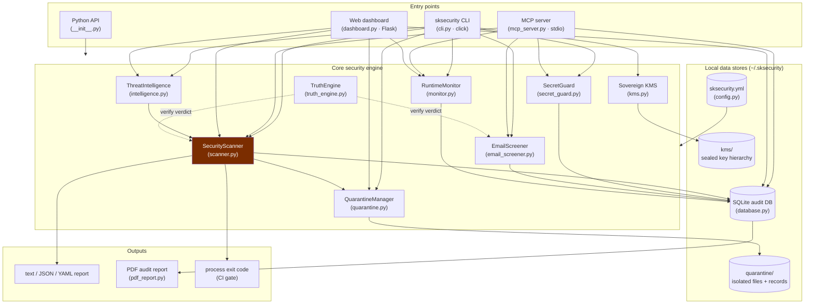
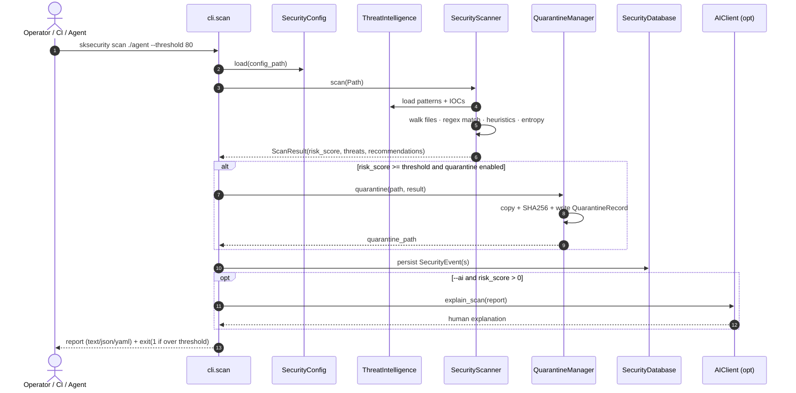
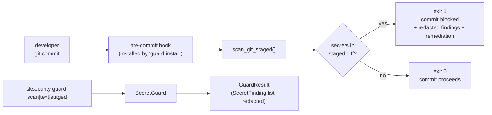
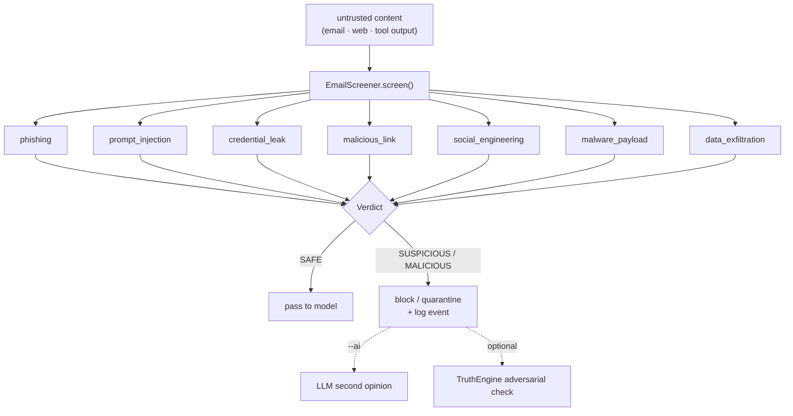
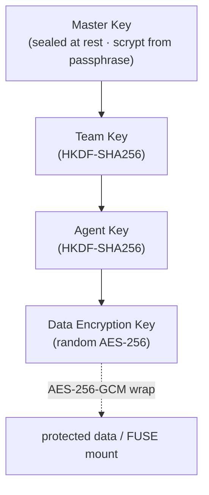
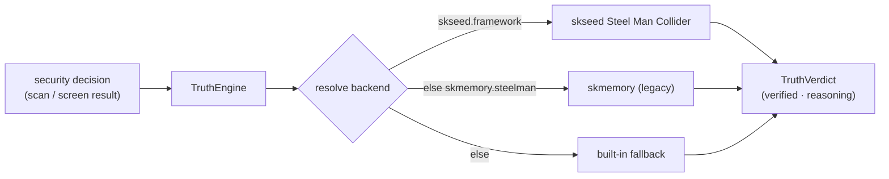
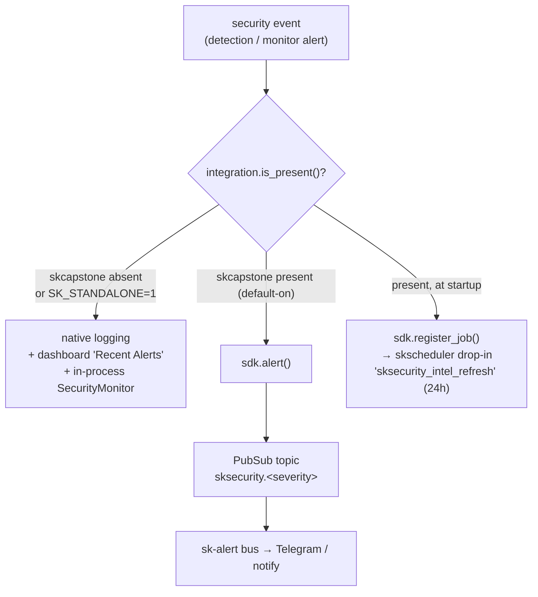
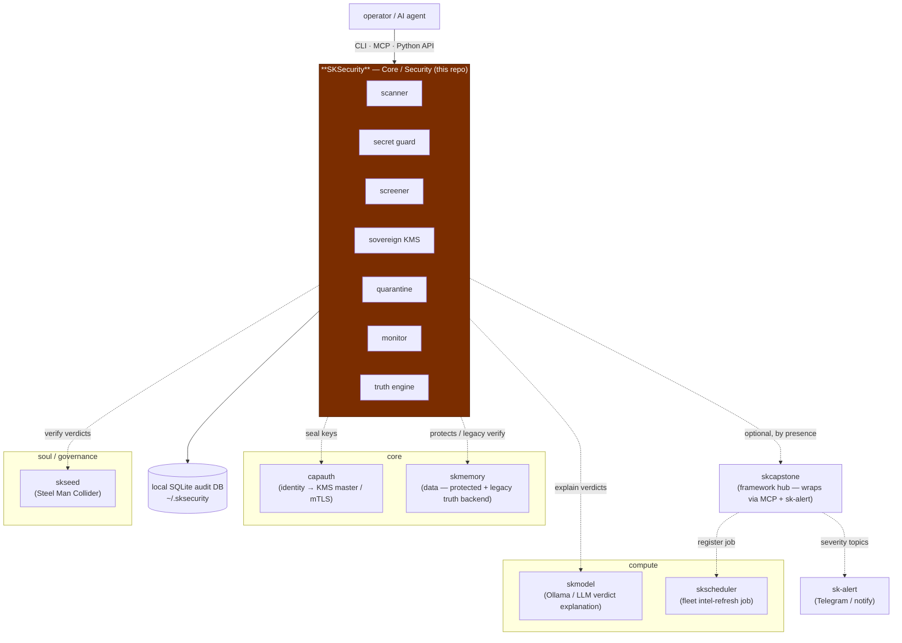

# SKSecurity Architecture

How SKSecurity works: the entry points, the core engine, the data it owns, the
optional peers it talks to, and the workflows that tie them together. Written to
be readable by someone meeting the system for the first time — accessible first,
precise underneath.

All mermaid node labels use ` ` for line breaks and quote any label
containing special characters, so they render in strict-mode mermaid.

---

## 1. The shape of it

SKSecurity is **one Python package** (`sksecurity/`) exposing **one core engine**
behind **four entry points** (CLI, MCP server, Python API, web dashboard), writing
to a small set of **local data stores**, and optionally talking to a few **peers**
in the SKWorld vertical. Nothing leaves the box by default.

The design rule throughout: **degrade gracefully**. Every optional dependency
(`skcapstone`, `skseed`, `skmemory`, an LLM endpoint, `flask`) is a soft import. If
it's missing, the affected feature falls back to a local default rather than failing.

---

## 2. Source map

| Module | Role |
|---|---|
| `sksecurity/__init__.py` | Public API surface + `DEFAULT_CONFIG`, `quick_scan()`, version/banner |
| `sksecurity/cli.py` | `click` command group — `scan`, `screen`, `guard`, `monitor`, `quarantine`, `update`, `audit`, `status`, `init`, `dashboard` |
| `sksecurity/scanner.py` | `SecurityScanner` + `ScanResult`/`ThreatMatch` — multi-layer file/dir analysis → 0–100 `risk_score` |
| `sksecurity/secret_guard.py` | `SecretGuard` + 14 `SECRET_PATTERNS`, git pre-commit hook installer, test-context false-positive filtering |
| `sksecurity/email_screener.py` | `EmailScreener` + `Verdict`/`ThreatCategory` enums — pre-model input screening (prompt injection, phishing, leaks, …) |
| `sksecurity/intelligence.py` | `ThreatIntelligence` + `ThreatSource`/`ThreatIndicator` — IOC library + external feed fetch/cache |
| `sksecurity/quarantine.py` | `QuarantineManager` + `QuarantineRecord` — isolate / list / restore / delete with SHA256 integrity |
| `sksecurity/kms.py` | Sovereign KMS — Master→Team→Agent→DEK hierarchy, AES-256-GCM, scrypt seal, HKDF derivation, rotation, audit |
| `sksecurity/monitor.py` | `RuntimeMonitor` / `SecurityMonitor` — `psutil` CPU/mem/disk monitoring + callback alerts |
| `sksecurity/truth_engine.py` | `TruthEngine` / `TruthVerdict` — Steel Man Collider verification (skseed → skmemory → built-in) |
| `sksecurity/database.py` | `SecurityDatabase` + `SecurityEvent` — local SQLite (SQLAlchemy) event store + stats |
| `sksecurity/config.py` | `SecurityConfig` / `SecurityPolicy` — YAML config, data-root resolution under `~/.sksecurity/` |
| `sksecurity/dashboard.py` | `DashboardServer` / `SecurityDashboard` — Flask REST API + UI (`[web]` extra) |
| `sksecurity/pdf_report.py` | `generate_audit_pdf()` — branded reportlab audit report |
| `sksecurity/ai_client.py` | `AIClient` — optional Ollama / OpenAI-compatible LLM for verdict explanation & assessment |
| `sksecurity/mcp_server.py` | MCP stdio server — `scan_path`, `screen_input`, `check_secrets`, `get_events`, `monitor_status` |
| `sksecurity/integration.py` | Optional skcapstone bridge — sk-alert bus + skscheduler job, default-on by package presence |

---

## 3. Workflow: a scan, end to end

The most common request lifecycle is `sksecurity scan <path>`. It exercises the
scanner, threat intelligence, quarantine, the database, and (optionally) the LLM
and truth engine — then sets a process exit code suitable for a CI gate.

**Scanner internals.** `SecurityScanner.scan()` walks the target, and for each file
runs layered analysis: regex threat-pattern matching (sourced from
`ThreatIntelligence`), heuristic checks (dangerous calls, obfuscation/encoding,
suspicious imports), and entropy scoring. Each hit becomes a `ThreatMatch`
(type, severity, confidence, file, line, context). Matches are aggregated into a
weighted `risk_score` (0–100) bucketed as LOW / MEDIUM / HIGH / CRITICAL, with
recommendations. The CLI exit code mirrors the threshold so `scan` drops cleanly
into CI and pre-deploy gates.

---

## 4. Workflow: secret guard + pre-commit

`SecretGuard` is the leak-prevention path. It runs against files, directories, raw
text, or the git staging area, using 14 compiled `SECRET_PATTERNS` (AWS keys,
GitHub/npm/OpenAI/Slack/SendGrid/Square/Stripe tokens, Mongo/Postgres connection
URLs, JWTs, PEM private keys, and a generic `key = "…"` catch-all), with a
test-context filter to suppress obvious placeholders (`your_`, `changeme`, `xxx`).

Findings are returned as `SecretFinding`s with the secret **redacted** (never the
raw value), a type label, a line number, and a remediation string. `guard install`
writes a git `pre-commit` hook so leaks are caught **before** they ever enter
history.

---

## 5. Workflow: input screening before the model

`EmailScreener` is the "screen it before the agent reads it" path — the AI-native
piece. It classifies content against seven `ThreatCategory`s and returns a
`Verdict` (`SAFE` / `SUSPICIOUS` / `MALICIOUS` / `QUARANTINED`). Agents call this on
untrusted input (emails, tool output, web content) *before* handing it to an LLM.

---

## 6. The sovereign KMS

`kms.py` is a self-contained key-management service built sovereign (MinIO KES is
AGPL, Vault is BSL — neither embeddable without infecting callers). It manages a
four-level hierarchy so a compromise is contained to one subtree:

Each level can decrypt only its own children. Keys are wrapped with AES-256-GCM,
the master is sealed with a scrypt-derived KEK, and every operation
(generate / derive / seal / rotate / revoke) appends to an **immutable local audit
log**. In an enterprise deployment a company PGP key (via **capauth**) can serve as
the master, with the KMS running as a sidecar that agents query at runtime.

---

## 7. The truth engine (graceful, optional)

`TruthEngine` lets the system *justify* a security verdict rather than just emit it.
It runs an adversarial "Steel Man Collider" pass over a decision and returns a
`TruthVerdict`. Backend resolution is strictly best-effort:

The engine **always works** — if neither `skseed` nor `skmemory` is importable it
uses a built-in heuristic, so verdict verification never becomes a hard dependency.

---

## 8. Integration: standalone vs. wired-in

SKSecurity is a **sovereign singleton**: no hard `skcapstone` import anywhere. The
optional `integration.py` adapter detects the framework hub *by package presence*
and, when found (and `SK_STANDALONE` is unset), upgrades two behaviours.

Severity → sk-alert level mapping (`level_for_severity()`): `critical→critical`,
`high→error`, `medium→warn`, `low→info`. The severity rides the **topic**; the
semantic event name (`process`, `secret_leak`, …) rides the payload `event` field,
so `skcapstone alerts` routes by severity. The 24-hour `sksecurity_intel_refresh`
job runs `sksecurity update --sources all` through the fleet scheduler.

---

## 9. Where it lives in SKStack v2

SKSecurity is a **Core** capability — the perimeter of the silicon→soul vertical.
It is the one capability designed to *protect* the others while depending on almost
none of them. Every cross-capability arrow below is **optional** and degrades to a
local default.

**Sovereignty stance.** Scan results, quarantine records, KMS keys, audit logs, and
cached threat intel all live under `~/.sksecurity/` on your hardware, encrypted at
rest with keys you own. The dashboard, PDF reports, and runtime monitors run locally.
Threat-intel feeds are configurable and local-first. Nothing is reported out — the
perimeter is yours.

---

Part of the **[SKWorld](https://skworld.io)** sovereign ecosystem · 🐧 smilinTux
