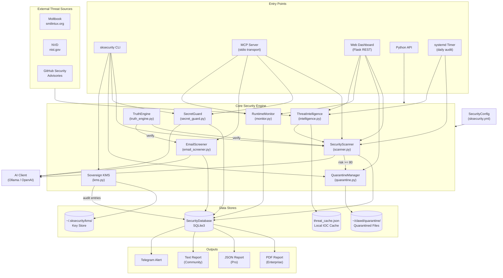
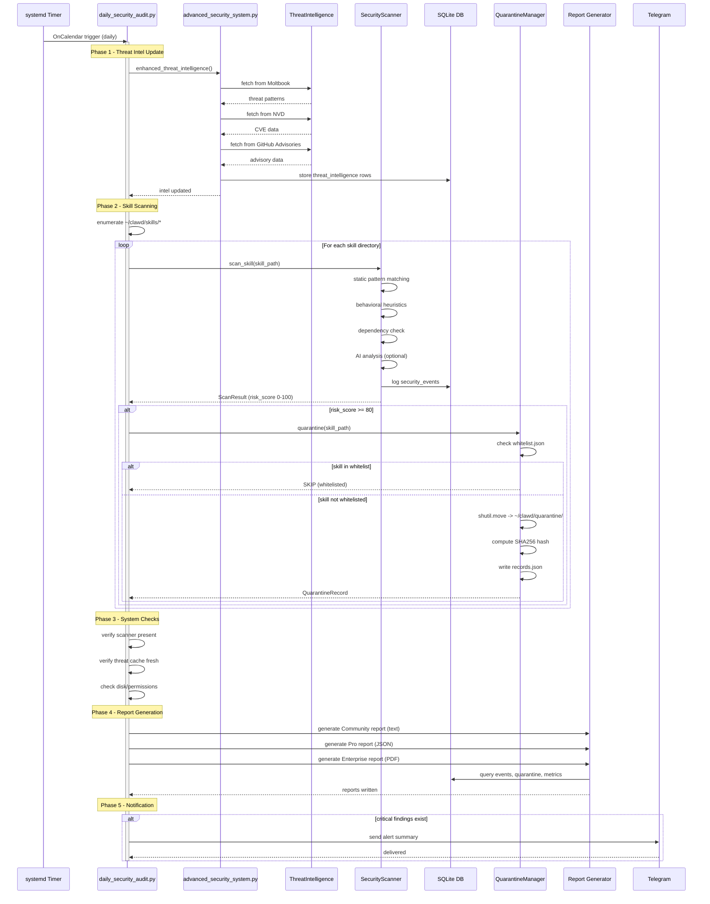
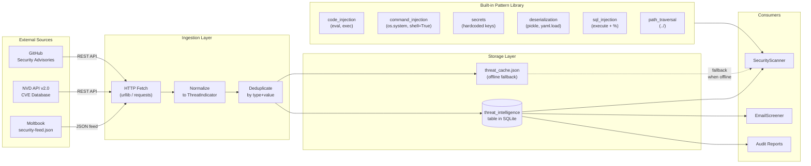
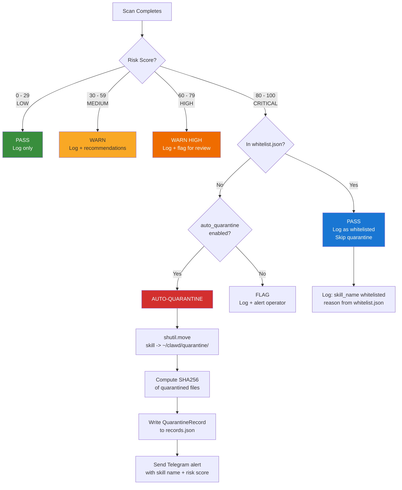
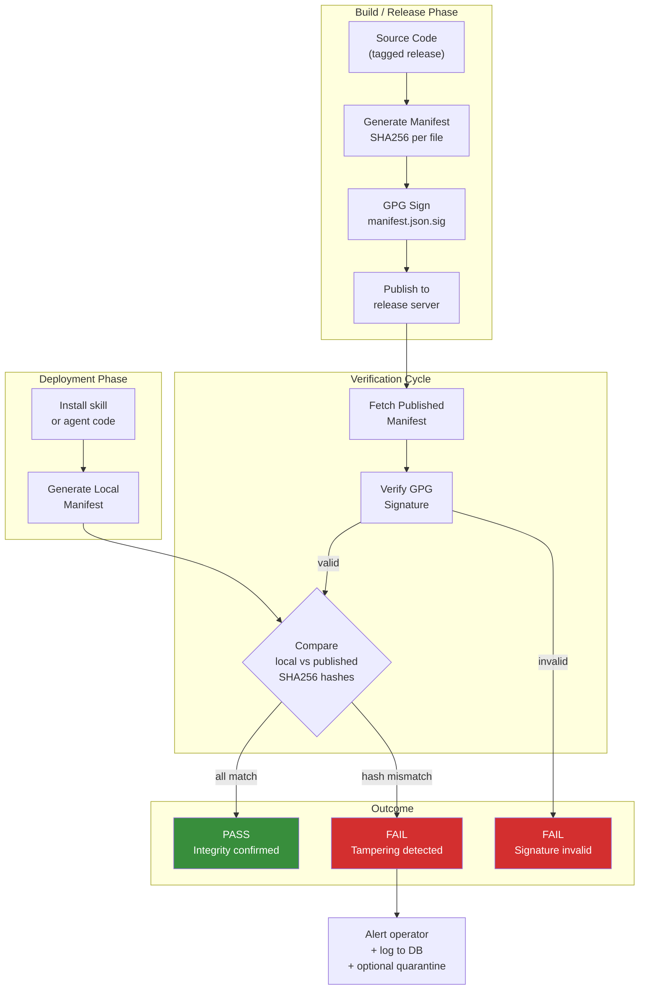
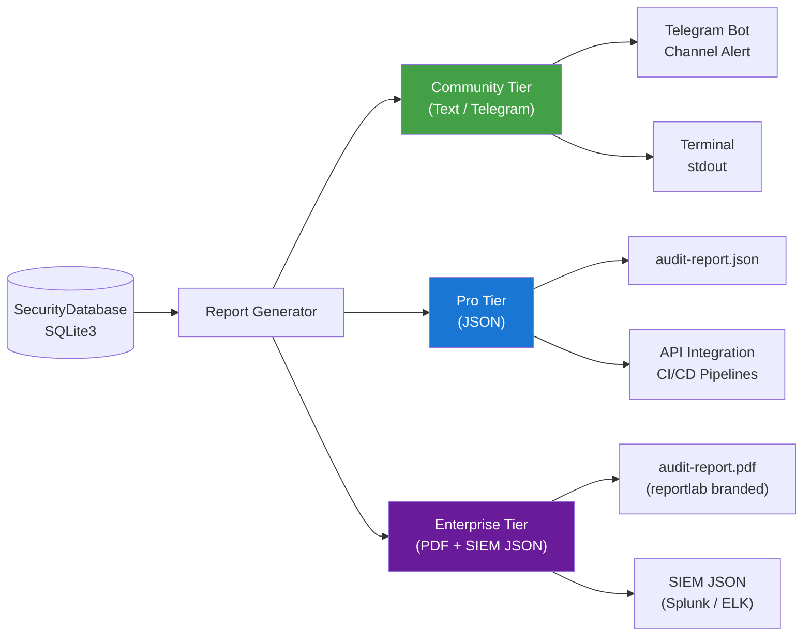
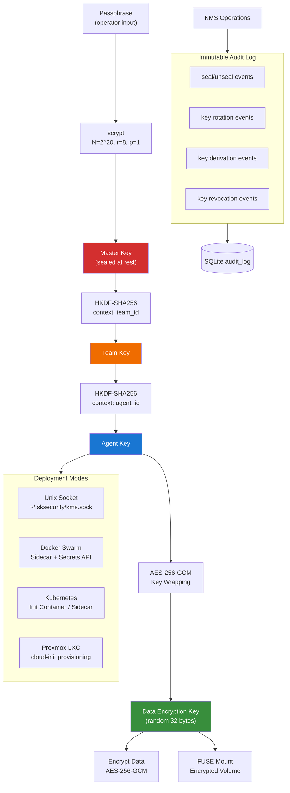
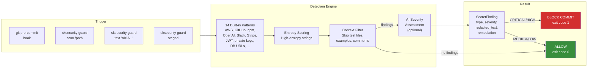
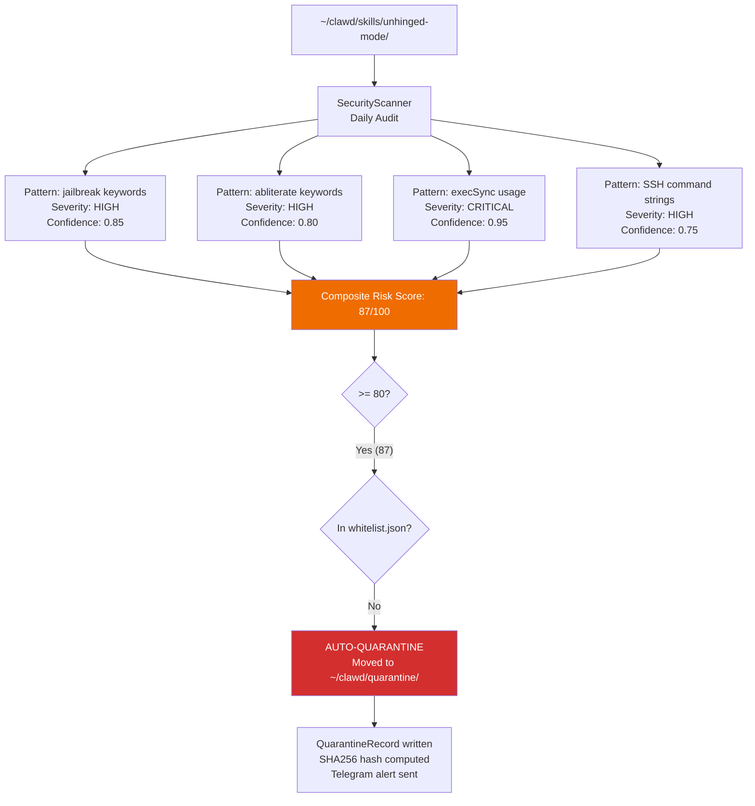
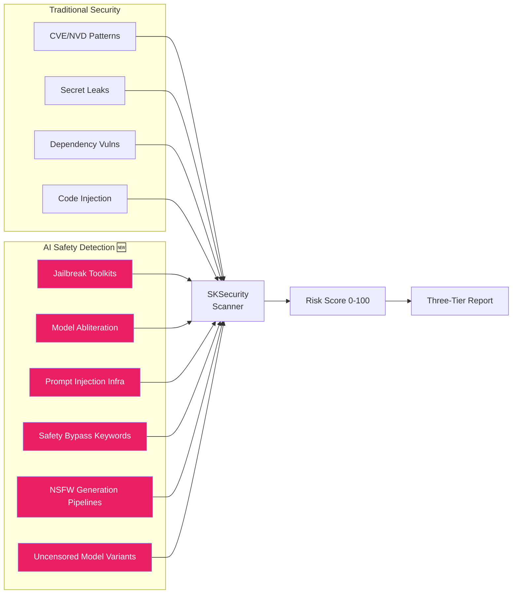

# SKSecurity Architecture

Comprehensive security architecture for sovereign AI agent ecosystems.
This document covers every major component, the data flows between them,
and the operational cycles that keep the system running autonomously.

---

## 1. System Overview



---

## 2. Audit Pipeline

The daily audit cycle runs unattended via a systemd timer. It updates
threat intelligence, scans every skill in `~/clawd/skills/`, generates
reports at three tiers, and pushes critical findings to Telegram.



---

## 3. Threat Intelligence Flow

Threat data flows from three external sources through a normalization
layer into a local SQLite database. The scanner consults this DB on
every scan, and the system falls back to a cached JSON file when
upstream sources are unreachable.



### Threat Source Details

| Source | URL | Data Format | Update Frequency | Priority |
|--------|-----|-------------|------------------|----------|
| Community AI Safety | `raw.githubusercontent.com/smilinTux/SKSecurity/main/community-threats/patterns/ai-safety.json` | JSON threat patterns | Per release | 1 (highest) |
| NVD | `services.nvd.nist.gov/rest/json/cves/2.0` | JSON CVE records | Daily | 2 |
| GitHub Advisories | `api.github.com/advisories` | JSON advisories | Daily | 3 |
| Built-in Patterns | Embedded in `scan_skill.py` | Regex patterns | Per release | Always available |

---

## 4. Quarantine Decision Tree

When a scan completes, the risk score determines what happens next.
The whitelist (`whitelist.json`) provides an operator-controlled
override for skills that have been reviewed and explicitly approved.



### Risk Score Calculation

The scanner computes a composite risk score (0-100) from four analysis layers:

| Layer | Weight | What It Checks |
|-------|--------|----------------|
| **Static Pattern Matching** | 40% | Regex against threat DB patterns (eval, exec, shell=True, etc.) |
| **Behavioral Heuristics** | 25% | SSL verification disabled, path traversal in writes, dynamic code execution |
| **Dependency Analysis** | 20% | Known-vulnerable packages, suspicious imports, typosquatting |
| **AI-Powered Analysis** | 15% | Ollama/OpenAI contextual analysis (graceful degradation if unavailable) |

---

## 5. Integrity Verification

The Call Home / Integrity Verification subsystem ensures that deployed
skills and agent code have not been tampered with. It works by generating
SHA256 manifests, optionally GPG-signing them, and comparing against
published release manifests.



### Manifest Format

```json
{
  "version": "1.0.0",
  "generated_at": "2026-03-11T00:00:00Z",
  "algorithm": "SHA256",
  "files": {
    "sksecurity/scanner.py": "a1b2c3d4...",
    "sksecurity/kms.py": "e5f6a7b8...",
    "sksecurity/quarantine.py": "c9d0e1f2..."
  },
  "signature": "manifest.json.sig"
}
```

> **Status:** The integrity verification system is currently under active
> development. Manifest generation and local comparison are functional.
> GPG signing integration and the published release manifest server are
> being built.

---

## 6. Report Tier Comparison

SKSecurity generates audit reports at three tiers, each targeting a
different audience and integration point.



### Tier Feature Matrix

| Feature | Community | Pro | Enterprise |
|---------|-----------|-----|------------|
| **Format** | Plain text | JSON | PDF + SIEM JSON |
| **Delivery** | stdout / Telegram | File / API | File / SIEM ingest |
| **Threat Summary** | Yes | Yes | Yes |
| **Per-File Details** | Top 10 | All | All |
| **Risk Score Breakdown** | Overall only | Per-layer | Per-layer + trend |
| **Quarantine Records** | Count | Full records | Full records + timeline |
| **Threat Intel Status** | Last update time | Source details | Source details + freshness |
| **Remediation Advice** | Basic | Detailed | Detailed + AI-generated |
| **Configuration Audit** | No | Partial | Full dump |
| **Database Metrics** | No | Yes | Yes + historical |
| **Branding** | N/A | N/A | smilinTux branded header |
| **Compliance Mapping** | No | No | SOC2 / NIST references |

---

## 7. Key Management Service (KMS)

The sovereign KMS provides hierarchical key management without
depending on HashiCorp Vault (BSL) or MinIO KES (AGPL).



### Key Hierarchy Properties

| Level | Derivation | Purpose | Compromise Impact |
|-------|-----------|---------|-------------------|
| **Master** | scrypt from passphrase + salt | Root of trust | Total (rotate all) |
| **Team** | HKDF-SHA256 from Master + team_id | Isolate teams | Team-scoped only |
| **Agent** | HKDF-SHA256 from Team + agent_id | Per-agent isolation | Single agent only |
| **DEK** | os.urandom(32), wrapped by Agent key | Encrypt actual data | Single data object |

---

## 8. Secret Guard Pipeline

The SecretGuard module prevents credential leaks via pre-commit hooks,
directory scanning, and real-time text checking.



---

## 9. Quarantine Case Study: `unhinged-mode`

This case study demonstrates the scanner working as designed: correctly
identifying security-relevant content and acting on it, then being
overridden by the infrastructure owner after manual review.

### What Happened

The `unhinged-mode` skill in `~/clawd/skills/` was auto-quarantined
during a daily audit scan. The scanner flagged it with a risk score
above 80 based on multiple threat pattern matches.

### Why It Was Flagged



### What the Scanner Detected

| Finding | Pattern Type | Severity | Why It Triggered |
|---------|-------------|----------|------------------|
| Jailbreak keywords | `jailbreak\|DAN\|ignore previous` | HIGH | Content references jailbreak techniques (legitimate research) |
| Abliterate keywords | `abliterate\|uncensor\|unfilter` | HIGH | References model uncensoring (intentional feature) |
| `execSync` usage | `execSync\(` | CRITICAL | Node.js synchronous shell execution detected |
| SSH command strings | `ssh\s+.*@` | HIGH | SSH connection commands in skill scripts |

### Resolution

The infrastructure owner (Chef/David) reviewed the quarantined skill and
determined that all flagged patterns were intentional and legitimate:

- **Jailbreak/abliterate references** are the skill's purpose (authorized
  AI research environment)
- **execSync** is used for local automation on sovereign infrastructure
- **SSH commands** connect to owned machines in the homelab

The skill was added to `whitelist.json` and restored:

```json
{
  "whitelist": ["unhinged-mode"],
  "reviewed_by": "Chef",
  "reviewed_at": "2026-03-10T12:00:00Z",
  "reason": "Authorized sovereign AI research skill. All flagged patterns are intentional."
}
```

### Why This Is a Feature

This case demonstrates every layer of the security architecture working
correctly:

1. **Detection** -- The scanner correctly identified security-relevant
   content. `execSync` and SSH commands ARE security-sensitive operations,
   regardless of intent.
2. **Automated response** -- The system did not wait for a human. It
   quarantined first, asked questions later.
3. **Operator override** -- The whitelist mechanism gives the infrastructure
   owner final authority. The system enforces security by default but
   respects sovereignty.
4. **Audit trail** -- Every step (scan, flag, quarantine, whitelist, restore)
   is logged in SQLite with timestamps.
5. **No false negative** -- A system that never flags legitimate-but-dangerous
   code would also miss actual attacks using the same patterns.

> The correct behavior for a security system is to flag first and let
> the operator decide. A scanner that silently ignores `execSync` and
> SSH patterns would be broken.

---

## 10. AI Safety Content Detection (NSFW/Jailbreak Scanner)

SKSecurity is unique among security tools in that it scans for **AI model
safety bypass patterns** — not just traditional vulnerabilities like SQLi or
XSS, but the emerging threat landscape of prompt injection, model abliteration,
jailbreak toolkits, and NSFW content generation pipelines.

No other open-source security scanner provides this capability.

### Why This Matters

As AI agents become infrastructure (running as services, managing data,
executing code), the attack surface shifts:

- **Traditional threat**: attacker exploits a buffer overflow in your web server
- **AI-era threat**: attacker ships a "helpful plugin" that removes your model's
  safety guardrails, injects system prompts, or abliterates refusal weights

These attacks look nothing like traditional malware. They look like:
- Python libraries with names like `abliterate.py` or `liberation.py`
- Shell scripts that inject text into `CLAUDE.md` or system prompts
- GGUF model files with `-unhinged` suffixes
- Config files mapping providers to `"injection": "system_prompt"`

Traditional scanners (ClamAV, Snyk, Trivy) will never flag these. They scan
for CVEs and known malware signatures. SKSecurity scans for **intent patterns**
specific to the AI agent ecosystem.

### Detection Categories



### AI Safety Threat Patterns

| Pattern | Regex / Heuristic | Severity | Real-World Example |
|---------|-------------------|----------|--------------------|
| Jailbreak toolkit | `jailbreak\|DAN\|ignore previous\|you are now` | HIGH | DAN prompts, Crescendo attacks |
| Model abliteration | `abliterate\|uncensor\|unfilter\|remove refusal` | HIGH | Arditi et al. refusal direction removal |
| Prompt injection infra | `system_prompt.*inject\|CLAUDE\.md.*inject` | CRITICAL | L1B3RT4S liberation prompt system |
| NSFW generation | `nsfw\|explicit\|uncensored.*model\|adult.*content` | HIGH | Uncensored Stable Diffusion pipelines |
| Safety bypass configs | `guardrail\|safety.*off\|filter.*disable` | MEDIUM | Model config overrides |
| Uncensored model files | `\-unhinged\|\-uncensored\|\-abliterated` | HIGH | Ollama model variants with safety removed |
| Weight surgery tools | `refusal.*direction\|activation.*steering` | HIGH | Mechanistic interpretability exploits |
| Reverse proxy injection | `proxy.*inject\|middleware.*system.*prompt` | CRITICAL | Man-in-the-middle prompt injection |

### Sovereign Override: The Whitelist

The critical insight: **not all AI safety bypasses are attacks**.

Legitimate use cases exist for every pattern above:
- **Security researchers** need jailbreak tools to test model robustness
- **Creative teams** need uncensored models for authentic fiction
- **Infrastructure owners** have the right to configure their own systems

SKSecurity solves this with the **whitelist + audit trail** pattern:

1. Scanner flags the content (correctly — it IS security-relevant)
2. Auto-quarantine isolates it (safe default)
3. Owner reviews and whitelists (sovereignty preserved)
4. Audit trail records the decision (compliance maintained)
5. Future scans skip whitelisted items (no repeated false positives)

This is the only security scanner that understands the difference between
"this looks dangerous" and "this IS dangerous" in the context of AI agent
infrastructure — and gives the operator the tools to make that distinction.

### SIEM Integration for AI Safety Events

Enterprise customers get AI safety events in the SIEM JSON export:

```json
{
  "event_type": "ai_safety_bypass_detected",
  "severity": "HIGH",
  "source": "skill_scanner",
  "description": "Model abliteration toolkit detected in skill 'unhinged-mode'",
  "metadata": {
    "skill_name": "unhinged-mode",
    "patterns_matched": ["abliterate", "jailbreak", "execSync", "ssh"],
    "risk_score": 87,
    "action_taken": "quarantined",
    "whitelist_status": "pending_review"
  }
}
```

This feeds directly into SOC dashboards, SOAR playbooks, and compliance
reporting — giving security teams visibility into AI-specific threats that
no other tool provides.

---

## 11. File Map

Quick reference for the source files that implement each component.

| Component | Source File | Entry Point |
|-----------|------------|-------------|
| Core Scanner | `sksecurity/scanner.py` | `SecurityScanner.scan_path()` |
| Threat Intelligence | `sksecurity/intelligence.py` | `ThreatIntelligence()` |
| Quarantine Manager | `sksecurity/quarantine.py` | `QuarantineManager.quarantine()` |
| Secret Guard | `sksecurity/secret_guard.py` | `SecretGuard.scan_directory()` |
| KMS | `sksecurity/kms.py` | `KMS()` (seal/unseal/derive) |
| Email Screener | `sksecurity/email_screener.py` | `EmailScreener.screen()` |
| Runtime Monitor | `sksecurity/monitor.py` | `RuntimeMonitor()` |
| Truth Engine | `sksecurity/truth_engine.py` | `TruthEngine.verify()` |
| Database | `sksecurity/database.py` | `SecurityDatabase()` |
| PDF Reports | `sksecurity/pdf_report.py` | `generate_audit_pdf()` |
| AI Client | `sksecurity/ai_client.py` | `AIClient()` |
| CLI | `sksecurity/cli.py` | `sksecurity` command |
| MCP Server | `sksecurity/mcp_server.py` | `sksecurity-mcp` command |
| Dashboard | `sksecurity/dashboard.py` | `sksecurity dashboard` |
| Config | `sksecurity/config.py` | `SecurityConfig.load()` |
| Daily Audit | `scripts/daily_security_audit.py` | `SecurityAuditor()` |
| Advanced System | `scripts/advanced_security_system.py` | `AdvancedSecuritySystem()` |
| Skill Scanner | `scripts/scan_skill.py` | `SecurityScanner.scan_skill()` |
| Threat Updater | `scripts/update_threats.py` | updates `threat_cache.json` |
| Inference Gateway | `src/gateway.mjs` | AI inference proxy with CapAuth |

---

## Related Documents

- **[SKSENTRY.md](SKSENTRY.md)** — Crowdsourced AI threat intelligence design
- **[INFERENCE-GATEWAY.md](INFERENCE-GATEWAY.md)** — AI inference proxy appliance (BlueCoat for AI) with CapAuth identity, policy engine, DLP, and model-specific adapters
