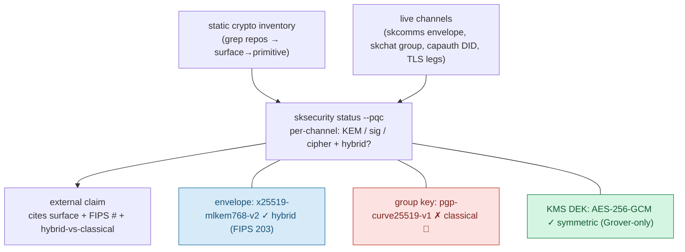

# SKSecurity — Quantum-Resistance: Crypto Inventory & Runtime Self-Report

**Status:** Documentation of the role SKSecurity plays in the ecosystem PQC migration.
**Docs-only** — code lands under epic `PQC-MIGRATION` (coord `e1d6ba2a`).
**Master plan / source of truth:** [skchat `docs/quantum-resistance-architecture.md`](https://github.com/smilinTux/skchat/blob/main/docs/quantum-resistance-architecture.md).
**Ecosystem standard:** [SKStacks `docs/CRYPTOGRAPHY_STANDARD.md`](https://github.com/smilinTux/skstacks/blob/main/docs/CRYPTOGRAPHY_STANDARD.md).
**Standards anchor:** FIPS 203 (ML-KEM), FIPS 204 (ML-DSA), FIPS 205 (SLH-DSA); NIST CSWP 39.

---

## 1. SKSecurity's role: making every claim evidence-backed

The single ecosystem rule for quantum-resistance claims: **every claim must cite the
surface + the FIPS number + hybrid-vs-classical, and be backed by a runtime
self-report. No claim without evidence.** SKSecurity is where that evidence is
produced — two deliverables:

1. **Static crypto inventory** (Phase 0): grep every repo (skcomms, skchat, capauth,
   sksecurity, skmemory) for `X25519|Ed25519|RSA|AES|Curve25519|PGP`; record
   surface → primitive. This is the map of what must migrate.
2. **Runtime self-report** (cross-cutting, GA'd in Q9): extend `sksecurity status`
   to report, **per live channel**, the negotiated KEM / signature / cipher and
   **hybrid-vs-classical**, citing FIPS 203/204/205. This is what makes every claim
   in the ecosystem *evidence-backed rather than asserted.*

---

## 2. Honest-claim rules (SKSecurity enforces these)

SKSecurity's claim-audit (Q9) scans docs/marketing for overclaiming. **Forbidden:**

- ❌ "quantum-proof" / "unbreakable" / "quantum-safe encryption" — use
  **"quantum-resistant"** / **"post-quantum,"** never "-proof."
- ❌ "end-to-end quantum-resistant" while any leg is classical.
- ❌ "PQC" when only signatures migrated — does nothing for HNDL.
- ❌ "CNSA 2.0 compliant" — we use the **-768 hybrid tier**, not the CNSA ceiling.
- ❌ "FIPS 206 / Falcon" — draft-stage.
- ❌ Implying **AES-256 is "broken" by quantum** — it is not (Grover halves it to
  ~128-bit, which is safe).

**SKSecurity's own crypto today:** the internal KMS tree
(`scrypt + HKDF-SHA256 + AES-256-GCM`, DEK = `os.urandom(32)`) is **entirely
symmetric/hash → already quantum-acceptable (🟢).** Caveat: if a PGP key is ever
wired as the master root, that root becomes Shor-vulnerable and must migrate to a
hybrid/SLH-DSA root.

---

## 3. The self-report (target shape)

Until the self-report shows a channel as hybrid, **no claim may assert** that
channel is quantum-resistant. The self-report is the gate.

---

## 4. The 11 vulnerable surfaces (inventory summary)

From the master plan §3. SKSecurity's inventory tracks all of them; the fix column
maps to sprints Q0–Q9 of epic `PQC-MIGRATION`.

| # | Surface | Owner repo | Quantum status | Fix → sprint |
|---|---|---|---|---|
| S1 | capauth root identity key | capauth | 🔴 Shor-broken (long-lived) | Q6 composite subkeys / SLH-DSA root |
| S2 | capauth challenge-response + DID sig | capauth | 🔴 future-forgery | Q7 hybrid sig |
| S3 | skcomms SignedEnvelope signature | skcomms | 🟡 hash fine, sig forgeable | Q7 hybrid sig |
| S4 | skcomms envelope payload wrap | skcomms | 🔴 HNDL | Q3 hybrid KEM wrap |
| S5 | skchat group-key distribution | skchat | 🔴 HNDL + highest leverage | Q2 epoch ratchet + hybrid KEM |
| S6 | skchat 1:1 DM crypto | skchat | 🔴 KEM / 🟡 sig | Q3 (KEM) / Q7 (sig) |
| S7 | CapAuth Bunker E2E | capauth | 🟡 ephemeral, low HNDL | Q1 stretch / Phase 3 |
| S8 | Transport: Tailscale/WireGuard | external | 🔴 HNDL, no in-WG fix | Q8 document + optional PSK |
| S9 | Transport: Cloudflare TLS (origin leg) | external | 🟡 edge partial, origin vuln | Q8 OpenSSL 3.5 origins |
| S10 | Transport: LiveKit/WebRTC DTLS-SRTP | external | 🔴 handshake / low HNDL | Q8 track upstream |
| S11 | Stored long-lived secrets (skmem-pg, memory trees, root backup) | cross | 🔴 HNDL — prime target | Q4 hybrid key-wrap |

**Symmetric surfaces already fine (do NOT redo):** AES-256-GCM bulk ciphers,
SHA-256 hashes, HKDF/scrypt KDFs across all repos. Touching them is wasted effort;
downgrading AES-256 would be a regression.

---

## 5. The browser / Flutter PQC gap (relevant to the self-report)

- **WebCrypto has NO PQC API in any browser (2026).** A web client cannot do
  app-layer ML-KEM natively — so the self-report MUST flag any web leg as
  reduced-assurance, and **no claim may imply the browser is E2E PQ.**
- **Native (Flutter/desktop):** solved via FFI to liboqs (ship the binary
  per-platform in CI).
- **Open decision (surfaced, not decided):** native-only PQ now (recommended),
  WASM-liboqs later, or a non-Flutter client. On record in master plan §7.

---

## 6. Cross-links

- **Master plan / source of truth:** [skchat `docs/quantum-resistance-architecture.md`](https://github.com/smilinTux/skchat/blob/main/docs/quantum-resistance-architecture.md)
- **Ecosystem standard:** SKStacks `docs/CRYPTOGRAPHY_STANDARD.md`
- **skchat / skcomms crypto views:** `docs/crypto-architecture.md` in each repo
- **capauth crypto view:** capauth `docs/CRYPTO_SPEC.md`
- **Epic:** `PQC-MIGRATION` (coord `e1d6ba2a`), tag `quantum-resistance`.
