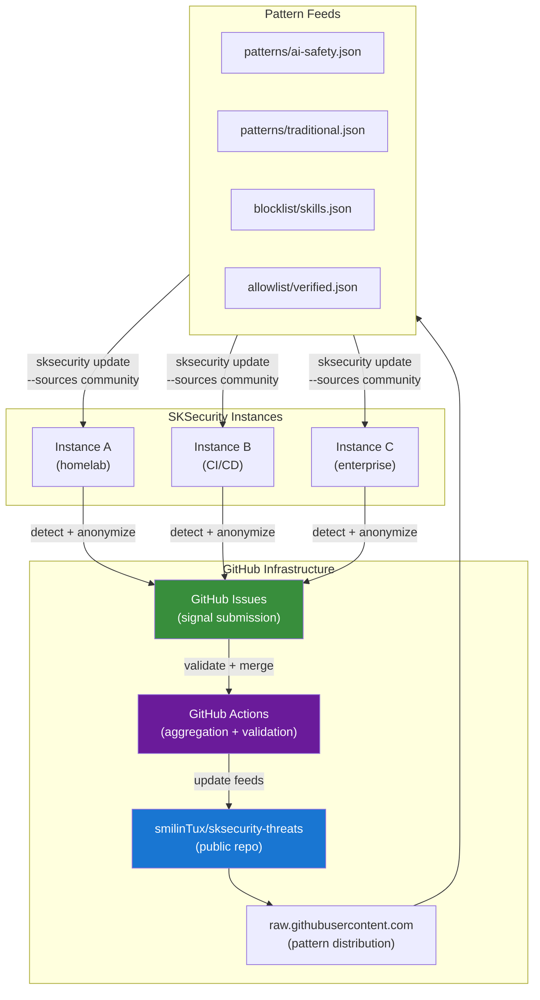
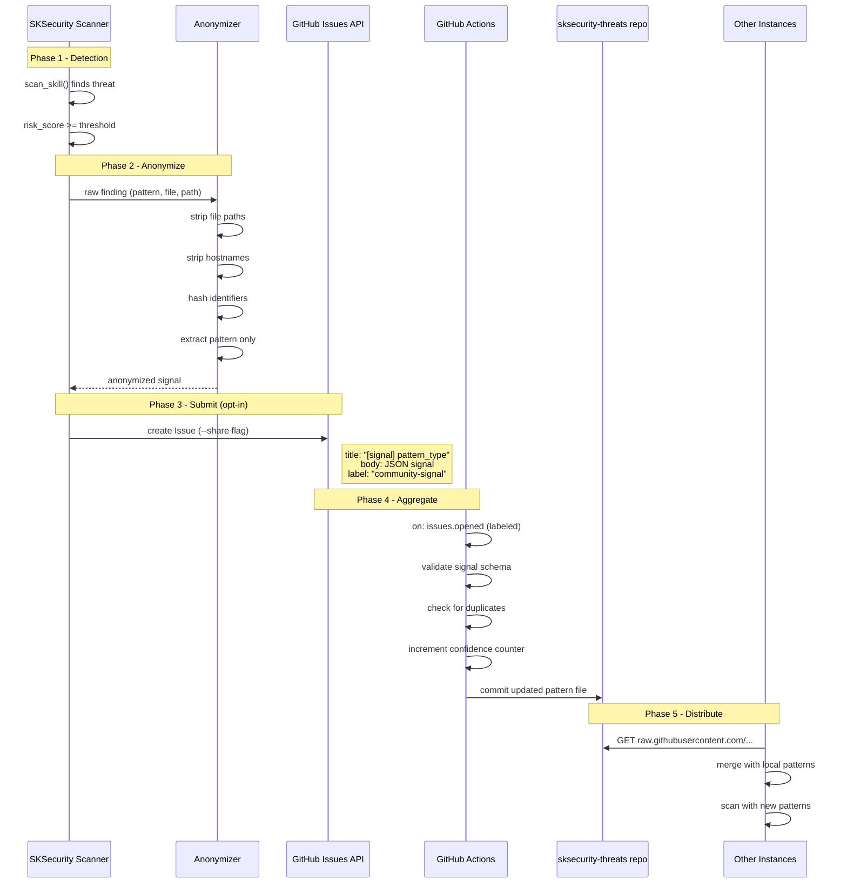
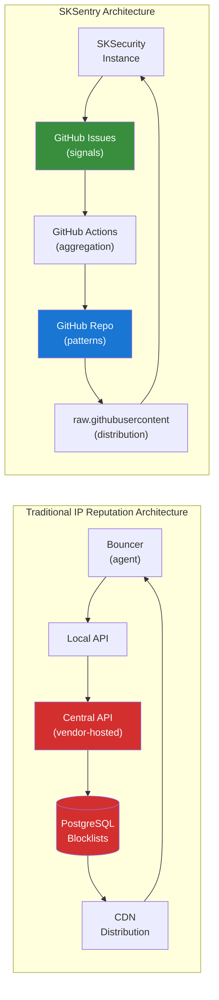

# SKSentry — Crowdsourced AI Threat Intelligence

*Community-powered AI threat defense.*

Design document for SKSentry, the crowdsourced threat intelligence layer of
SKSecurity. When one instance detects a new AI threat, every instance gets
protected. Zero new infrastructure. GitHub IS the infrastructure.

---

## 1. Concept

Inspired by the participative security model pioneered by projects like
[CrowdSec](https://www.crowdsec.net/), SKSentry applies the same principle to
AI-specific threats: when one node detects an attack, every node benefits.
SKSentry covers **AI-specific threats** -- jailbreak patterns, abliteration
toolkits, prompt injection techniques, NSFW generation pipelines, and uncensored
model variants.

No other threat-sharing system covers this attack surface because no other
security tool even scans for it.

### What Makes SKSentry Different

| Traditional IP Reputation | SKSentry |
|--------------------------|----------|
| IP reputation / ban lists | Pattern reputation / confidence scores |
| Detects network attacks (DDoS, brute-force) | Detects AI-era attacks (jailbreak, abliteration, prompt injection) |
| Requires a central API + account | Uses GitHub repos, Issues, and raw URLs -- no account needed to read |
| Agents phone home with IP blocklists | Agents pull pattern feeds from raw.githubusercontent.com |
| Commercial backend infrastructure | 100% public, auditable, forkable |
| Focused on perimeter defense | Focused on AI agent supply chain defense |

---

## 2. Architecture Overview



---

## 3. Signal Flow

The complete lifecycle of a community threat signal, from initial detection
through anonymization, submission, aggregation, and distribution.



---

## 4. Threat Pattern Schema

Every pattern in the community feed follows this schema. The schema file is
at `community-threats/schema.json` and can be used for validation.

### Pattern Object

```json
{
  "id": "ai-safety-001",
  "pattern": "abliterate|uncensor|unfilter|remove refusal",
  "type": "ai_model_abliteration",
  "category": "ai-safety",
  "severity": "HIGH",
  "confidence": 0.85,
  "description": "Detects tools that remove safety guardrails from AI models",
  "references": ["https://arxiv.org/abs/2401.xxxxx"],
  "tags": ["abliteration", "safety-bypass", "model-surgery"],
  "reporters": 1,
  "first_seen": "2026-03-11T00:00:00Z",
  "last_updated": "2026-03-11T00:00:00Z"
}
```

### Signal Object (submitted via Issues)

```json
{
  "signal_version": "1.0",
  "pattern": "eval\\(.*atob",
  "type": "obfuscated_code",
  "category": "traditional",
  "severity": "CRITICAL",
  "context": "skill",
  "hash": "sha256:a1b2c3d4e5f6...",
  "instance_id": "sha256(hostname+salt)",
  "timestamp": "2026-03-11T12:00:00Z"
}
```

### Field Definitions

| Field | Type | Required | Description |
|-------|------|----------|-------------|
| `id` | string | yes | Unique pattern identifier (category-NNN format) |
| `pattern` | string | yes | Regex pattern for detection |
| `type` | string | yes | Pattern type (see categories below) |
| `category` | enum | yes | `ai-safety` or `traditional` |
| `severity` | enum | yes | `LOW`, `MEDIUM`, `HIGH`, `CRITICAL` |
| `confidence` | float | yes | 0.0 to 1.0 -- how likely a match is a true positive |
| `description` | string | yes | Human-readable description |
| `references` | array | no | URLs to relevant research, CVEs, advisories |
| `tags` | array | no | Searchable tags |
| `reporters` | int | yes | Number of independent instances that reported this pattern |
| `first_seen` | datetime | yes | ISO 8601 timestamp |
| `last_updated` | datetime | yes | ISO 8601 timestamp |

### Pattern Categories

**AI Safety (`ai-safety`)**
- `ai_jailbreak_toolkit` -- DAN prompts, Crescendo attacks, system prompt overrides
- `ai_model_abliteration` -- Refusal direction removal, weight surgery
- `ai_prompt_injection` -- System prompt injection infrastructure
- `ai_safety_bypass` -- Guardrail disabling, filter circumvention
- `ai_nsfw_pipeline` -- Uncensored generation, explicit content pipelines
- `ai_uncensored_model` -- Model variants with safety removed
- `ai_weight_surgery` -- Activation steering, mechanistic interpretability exploits
- `ai_proxy_injection` -- MITM prompt injection via reverse proxy

**Traditional (`traditional`)**
- `code_injection` -- eval(), exec(), dynamic code execution
- `command_injection` -- os.system(), subprocess with shell=True
- `hardcoded_secrets` -- API keys, tokens, private keys
- `deserialization` -- pickle, unsafe YAML
- `remote_code_execution` -- curl|bash, wget|sh
- `dependency_vulnerability` -- Known-vulnerable packages
- `obfuscated_code` -- Hex encoding, base64 obfuscation
- `reverse_shell` -- Socket-based shells
- `privilege_escalation` -- sudo NOPASSWD, setuid
- `crypto_mining` -- Mining software signatures

---

## 5. Privacy Guarantees

This is the most important section. Community threat sharing only works if
operators trust that their data stays private.

### What IS Shared

- **Regex patterns** that matched (the pattern itself, not what it matched)
- **Pattern type and severity** (categorical metadata)
- **SHA256 hash** of the matched content (one-way, irreversible)
- **Context type** (`skill`, `plugin`, `model`, `config` -- never the name)
- **Anonymized instance ID** (SHA256 of hostname + per-install salt)
- **Timestamp** of detection

### What is NEVER Shared

- File paths or directory structures
- File contents or code snippets
- Hostnames, IPs, or usernames
- Skill names or project names
- Agent configurations or soul blueprints
- Memory contents or conversation history
- Any PII whatsoever

### How Anonymization Works

```python
def anonymize_signal(finding: dict, salt: str) -> dict:
    """Strip everything except the pattern and categorical metadata."""
    return {
        "signal_version": "1.0",
        "pattern": finding["pattern"],          # the regex, not the match
        "type": finding["type"],                 # categorical
        "category": finding.get("category", "traditional"),
        "severity": finding["severity"],         # categorical
        "context": finding.get("context", "unknown"),  # skill|plugin|model
        "hash": hashlib.sha256(
            finding.get("matched_content", "").encode()
        ).hexdigest(),                           # one-way hash only
        "instance_id": hashlib.sha256(
            (socket.gethostname() + salt).encode()
        ).hexdigest(),                           # anonymized instance
        "timestamp": datetime.utcnow().isoformat() + "Z"
    }
```

### Opt-In Only

Signal submission requires the explicit `--share` flag:

```bash
# Normal scan -- nothing leaves your machine
sksecurity scan ~/clawd/skills/

# Scan + share anonymized signals with the community
sksecurity scan ~/clawd/skills/ --share
```

The `--share` flag can also be set in `sksecurity.yml`:

```yaml
community:
  share_signals: false    # default: false (opt-in)
  share_threshold: 80     # only share findings with risk >= 80
  feed_url: "https://raw.githubusercontent.com/smilinTux/sksecurity-threats/main"
```

---

## 6. Reputation System

SKSentry uses a consensus mechanism where patterns gain or lose confidence
based on community signals.

### Confidence Scoring

```
base_confidence = pattern.confidence  (set by pattern author)
reporter_bonus  = min(0.1, pattern.reporters * 0.02)  (more reporters = more trust)
whitelist_penalty = pattern.whitelist_count * -0.05    (operators whitelisting = less trust)

effective_confidence = clamp(base_confidence + reporter_bonus + whitelist_penalty, 0.1, 0.99)
```

### How It Works

1. **New pattern** submitted with `confidence: 0.7` and `reporters: 1`
2. **Second instance** reports the same pattern -> `reporters: 2`, confidence goes up
3. **Third instance** whitelists it (legitimate use) -> `whitelist_count: 1`, confidence drops
4. **Ten instances** report it -> high reporter count overrides occasional whitelists
5. Patterns with `confidence < 0.3` after 90 days are archived (not deleted)

### Counters (stored in repo)

```json
{
  "ai-safety-001": {
    "reporters": 14,
    "whitelist_count": 2,
    "effective_confidence": 0.88,
    "last_signal": "2026-03-10T15:30:00Z"
  }
}
```

These counters live in `reputation/counters.json` in the threat repo and are
updated by GitHub Actions when new signals arrive.

---

## 7. Pull Mechanism

The community feed integrates directly into the existing `ThreatIntelligence`
pipeline. No new code paths needed -- just a new source.

### Integration with intelligence.py

```python
# In ThreatIntelligence._default_sources():
{
    "name": "Community",
    "url": "https://raw.githubusercontent.com/smilinTux/sksecurity-threats/main/patterns/ai-safety.json",
    "enabled": True,
    "priority": 2
},
{
    "name": "Community-Traditional",
    "url": "https://raw.githubusercontent.com/smilinTux/sksecurity-threats/main/patterns/traditional.json",
    "enabled": True,
    "priority": 2
}
```

### Update Command

```bash
# Update all sources (Moltbook + NVD + Community)
sksecurity update

# Update community feed only
sksecurity update --sources community

# Update and show what changed
sksecurity update --verbose
```

### Caching

- Patterns are cached locally in `~/.sksecurity/threat_cache.json`
- Cache TTL: 24 hours (configurable)
- If GitHub is unreachable, cached patterns are used
- Built-in patterns are ALWAYS available regardless of network state

### Raw URL Endpoints

```
https://raw.githubusercontent.com/smilinTux/sksecurity-threats/main/patterns/ai-safety.json
https://raw.githubusercontent.com/smilinTux/sksecurity-threats/main/patterns/traditional.json
https://raw.githubusercontent.com/smilinTux/sksecurity-threats/main/blocklist/skills.json
https://raw.githubusercontent.com/smilinTux/sksecurity-threats/main/allowlist/verified.json
https://raw.githubusercontent.com/smilinTux/sksecurity-threats/main/reputation/counters.json
```

All public. No auth token needed. No rate limiting for raw content.

---

## 8. Blocklist and Allowlist

### Skill Blocklist (`blocklist/skills.json`)

Known-malicious skill signatures identified by SHA256 hash.

```json
{
  "version": "1.0",
  "updated": "2026-03-11T00:00:00Z",
  "entries": [
    {
      "sha256": "e3b0c44298fc1c149afbf4c8996fb924...",
      "name_pattern": "evil-*",
      "reason": "Known backdoor installer",
      "severity": "CRITICAL",
      "added": "2026-03-11T00:00:00Z"
    }
  ]
}
```

### Verified Allowlist (`allowlist/verified.json`)

Community-verified safe skills. Operators can auto-trust these.

```json
{
  "version": "1.0",
  "updated": "2026-03-11T00:00:00Z",
  "entries": [
    {
      "sha256": "abc123...",
      "name": "security-scanner",
      "repo": "github.com/smilinTux/SKSecurity",
      "verified_by": ["smilinTux", "community-review"],
      "verified_at": "2026-03-11T00:00:00Z"
    }
  ]
}
```

---

## 9. GitHub Actions Automation

A single workflow handles signal validation and pattern aggregation.

```yaml
# .github/workflows/process-signal.yml
name: Process Community Signal
on:
  issues:
    types: [opened]

jobs:
  process:
    if: contains(github.event.issue.labels.*.name, 'community-signal')
    runs-on: ubuntu-latest
    steps:
      - uses: actions/checkout@v4

      - name: Validate signal schema
        run: |
          python scripts/validate_signal.py "${{ github.event.issue.body }}"

      - name: Check for duplicate
        run: |
          python scripts/check_duplicate.py "${{ github.event.issue.body }}"

      - name: Update pattern confidence
        run: |
          python scripts/update_confidence.py "${{ github.event.issue.body }}"

      - name: Commit updated patterns
        run: |
          git config user.name "sksecurity-bot"
          git config user.email "bot@sksecurity.dev"
          git add patterns/ reputation/
          git commit -m "Update patterns from signal #${{ github.event.issue.number }}" || true
          git push
```

---

## 10. Implementation Roadmap

### Phase 1: Read-Only Feed (Week 1-2)

**Goal:** Any SKSecurity instance can pull community patterns.

- [ ] Create `smilinTux/sksecurity-threats` public repo
- [ ] Seed `patterns/ai-safety.json` with existing AI safety patterns
- [ ] Seed `patterns/traditional.json` with existing traditional patterns
- [ ] Add community feed URLs to `ThreatIntelligence._default_sources()`
- [ ] Add `--sources community` filter to `sksecurity update` CLI
- [ ] Test: fresh install pulls patterns and uses them in scans
- [ ] Tag `v1` on the threat repo

**Zero new infrastructure.** The repo exists on GitHub. Patterns are JSON.
The existing `ThreatSource.fetch()` method already handles HTTP GET + JSON parse.

### Phase 2: Signal Submission (Week 3-4)

**Goal:** Instances can optionally submit anonymized signals.

- [ ] Implement `anonymize_signal()` function in `sksecurity/intelligence.py`
- [ ] Add `--share` flag to `sksecurity scan` CLI
- [ ] Submit signals as GitHub Issues via `gh issue create` or GitHub API
- [ ] Add `community.share_signals` config option (default: false)
- [ ] Add `community.share_threshold` config option (default: 80)
- [ ] Create signal schema validation script for the threat repo
- [ ] Set up GitHub Actions workflow to process incoming signals
- [ ] Test: scan with `--share` creates a properly anonymized Issue

**Still zero new infrastructure.** GitHub Issues are free and unlimited for
public repos. The `gh` CLI is already installed on most dev machines.

### Phase 3: Reputation System (Week 5-6)

**Goal:** Patterns gain/lose confidence based on community consensus.

- [ ] Add `reputation/counters.json` to threat repo
- [ ] Implement confidence scoring in GitHub Actions
- [ ] Add `reporters` and `whitelist_count` fields to pattern schema
- [ ] Implement whitelist signal (operator marks pattern as FP)
- [ ] Add `sksecurity report --community` to show pattern reputation
- [ ] Archive low-confidence patterns after 90 days
- [ ] Tag `v2` on the threat repo

### Phase 4: Ecosystem Growth (Ongoing)

- [ ] `CONTRIBUTING.md` with pattern submission guide
- [ ] Invite AI safety researchers to submit patterns
- [ ] Cross-reference with MITRE ATLAS (AI threat framework)
- [ ] Monthly "threat landscape" reports generated from signal data
- [ ] Integration with skcapstone MCP tools for agent-to-agent threat sharing

---

## 11. Threat Model

### What Could Go Wrong

| Threat | Mitigation |
|--------|-----------|
| Attacker submits false patterns to cause FPs | Reputation system + manual review for high-severity patterns |
| Attacker submits patterns that leak info | Schema validation strips everything except regex + metadata |
| GitHub goes down | Local cache + built-in patterns always available |
| Pattern regex causes ReDoS | Validate regex complexity in GitHub Actions before merge |
| Someone forks the repo and poisons it | `feed_url` is pinned in config; operator must explicitly change it |
| Signal deanonymization via pattern correlation | Instance ID is salted SHA256; pattern is the regex not the match |

### Trust Hierarchy

```
Built-in patterns (ship with sksecurity)     <- highest trust
  |
  v
Moltbook feed (smilinTux controlled)         <- high trust
  |
  v
Community patterns (reporters >= 5)           <- medium trust
  |
  v
Community patterns (reporters == 1)           <- low trust (informational)
  |
  v
Unverified signals (GitHub Issues)            <- no trust until validated
```

---

## 12. Cost Analysis

| Component | Cost | Notes |
|-----------|------|-------|
| GitHub public repo | Free | Unlimited for public repos |
| GitHub Issues | Free | Unlimited for public repos |
| GitHub Actions | Free | 2000 minutes/month for public repos |
| raw.githubusercontent.com | Free | No rate limit for reasonable usage |
| `gh` CLI | Free | Ships with Git, pre-installed on most systems |
| Storage | ~0 | JSON files, kilobytes total |
| **Total** | **$0.00** | **Free.99** |

---

## 13. CLI Reference

```bash
# Pull latest community patterns
sksecurity update --sources community

# Scan with community patterns included
sksecurity scan ~/clawd/skills/

# Scan and share anonymized signals
sksecurity scan ~/clawd/skills/ --share

# Check a specific pattern's reputation
sksecurity community info ai-safety-001

# Submit a whitelist signal (this pattern is a false positive for me)
sksecurity community whitelist ai-safety-003 --reason "authorized research tool"

# Show community feed status
sksecurity community status
```

---

## Appendix: SKSentry vs Traditional Threat Sharing



**Traditional threat sharing** requires: PostgreSQL, a central API server, CDN,
user accounts, commercial infrastructure.

**SKSentry** requires: a GitHub account (which you already have).
